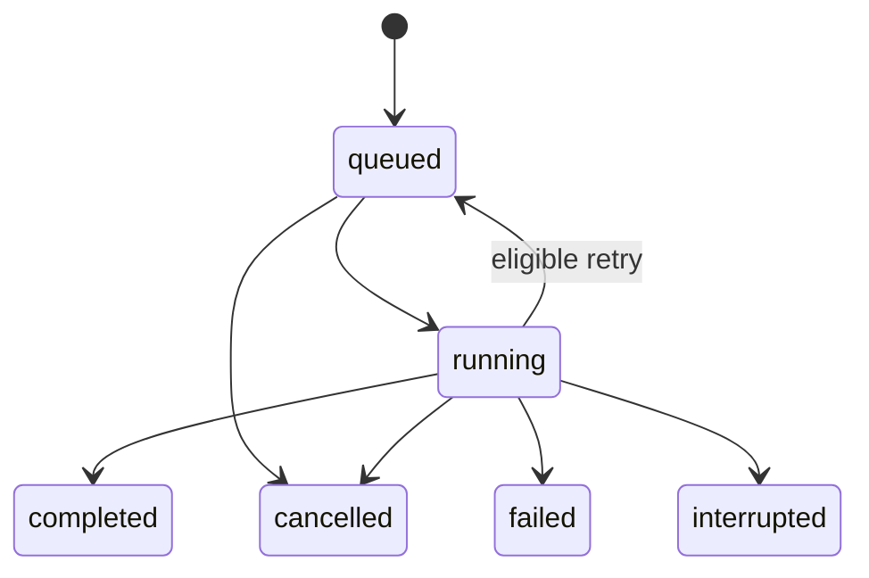

# Cutbolt agent interface (v0.4)

Optional [foreground masks](SEGMENTATION.md) use a separate local CLI producer. Its scene results, including per-frame matte identities, are accepted by typed `scene.inspect`; no network service or additional MCP tool is introduced.

The existing `scene.inspect` tool accepts optional typed [geometry](GEOMETRY.md), reporting sampled cameras/lights, world matrices and bounded work. Rendering remains the blocking local scene command.

`expression.inspect` is a read-only typed MCP tool accepting a scene and rational sample times. It reports exact node values and rounded position/opacity bindings without media access or file writes. See [expressions](EXPRESSIONS.md) for limits, clocks and the distinction from complete scene compilation.

The ten foundational checks cover local commands, saved editing sessions, render job control and MCP stdio. Passing them does not validate every editing feature, operating system, failure mode or client. The tested environment is Windows with the narrow FFV1/PCM render profile. See [PROGRESS.md](PROGRESS.md) and [verification evidence](../verification/latest.json).

## Local background renders

Create an existing absolute local `job_root` outside the repository. It contains `jobs.sqlite3` and `worker.lock`, separate from the editing-session store. The queue migrates its own schema from version 1 to 2 transactionally; it does not migrate editing sessions. Do not delete or replace the lock file while workers run. Use trusted local storage with normal file locks, not network shares.

| Command | Arguments besides `command` | Result |
| --- | --- | --- |
| `render.start` | `job_root`, `request_id`, `render` containing `project`, `input_root`, `output_root`, `output`, optional `retry` | Stable ticket: `job_id`, `project_id`, `project_revision` |
| `job.status` | `job_root`, `job_id` | Saved state, cancellation flag, progress, result or error |
| `job.cancel` | `job_root`, `job_id` | Request cancellation; poll for a terminal state |
| `job.resume` | `job_root` | Wake a worker to drain queued work after restart |
| `job.start` | `job_root`, `request_id`, `run` (a long-running command), `arguments` (its arguments) | Stable ticket: `job_id`, `command` |
| `job.wait` | `job_root`, `job_id`, optional `timeout_seconds` (1-120, default 30) | The `job.status` view once the job finishes or the wait ends, with `finished` |

`job.start` queues the long-running commands that are not direct MCP tools: `export.run`, `media.prepare`, `media.conform`, `scene.render`, `audio.render`, `audio.repair.render`, `hdr.conform`, `image.sequence.compile`, `proxy.generate`, `preview.range`, `cache.run` and `transcript.transcribe`. Its `arguments` are prepared and validated at submission exactly like a direct call. That includes workspace defaults, saved-project references and path-only identities, and an invalid argument fails immediately, named `arguments.<field>`. The job's result is the command's own receipt.

These jobs share the queue's request IDs, ticket replay, output reservation and 32-job limit. A queued job can be cancelled; a running one finishes, because these commands publish their own outputs atomically and have no cancellation points. An interrupted run is reported, not retried. Reference renders keep `render.start` with its retry and publication recovery.

A runnable example using a retained demo from `tests/integration.py`:

```powershell
$demo = 'C:\DEV\CutboltData\my-demo'
$queue = 'C:\DEV\CutboltData\jobs'
New-Item -ItemType Directory -Path $queue -Force | Out-Null
$project = Get-Content -Raw "$demo\project.json" | ConvertFrom-Json
$request = @{command='render.start'; job_root=$queue; request_id='export-demo-001'; render=@{
    project=$project; input_root="$demo\media"; output_root="$demo\output"; output="$demo\output\agent-export.mkv"
}}
$ticket = ($request | ConvertTo-Json -Depth 30 -Compress | .\target\debug\cutbolt.exe | ConvertFrom-Json).result
@{command='job.status'; job_root=$queue; job_id=$ticket.job_id} |
    ConvertTo-Json -Compress | .\target\debug\cutbolt.exe
# To stop unfinished work:
@{command='job.cancel'; job_root=$queue; job_id=$ticket.job_id} |
    ConvertTo-Json -Compress | .\target\debug\cutbolt.exe
```

Fetch a saved project with `session.get` at an explicit receipt revision to render a stable edit. Submission pins the snapshot and selected local FFmpeg/ffprobe paths and hashes. It does not freeze source media at submission time. Full inspection occurs in the worker; the first validated source manifest must match on every later attempt, in addition to the existing inspection/render checks.

### Scheduling, progress and cancellation

Jobs persist before a detached, hidden worker starts. They survive the submitting CLI or MCP connection closing. There is at most one render per job root and up to 32 queued/running jobs per root. Additional submissions return `QUEUE_FULL`; an already committed request can still be replayed. Different roots have separate queues. Brief duplicate worker starts can occur after retries; an OS file lock grants only one ownership of the queue.



Status also includes `attempts.current`, `attempts.maximum` and ordered status/error history. Progress restarts for each attempt. Status includes `progress.phase` (`queued`, `inspecting`, `rendering`, `verifying`, then the terminal state), `frames` and `total_frames`. The frame count measures encoding progress, not an overall percentage: verification can continue after all frames are encoded. No ETA is estimated. `worker_pid` is historical diagnostic metadata; do not use an old PID to manage a process.

Cancellation is checked during hashing, probing and encoding, approximately every 100 ms where the OS/tool is responsive. This is not a hard real-time latency guarantee. Each tool runs inside a Windows process scope established before the external executable starts. Terminating the wrapper stops its descendants; terminating the queue worker also stops its tool tree. Normal cancellation removes that job's partial file and releases the queue for subsequent jobs.

Publication and cancellation serialize through the job-store writer transaction. If cancellation wins, no final file is published. If publication wins, cancellation returns the completed state and leaves the output intact. Queued cancellation never starts a media process. Errors retain structured code/message information. Nothing silently overwrites an existing output or source.

### Retry, restart and limitations

- `request_id` is unique within a job root. Identical `render.start` retries return the original ticket, even after completion or interruption. Changed arguments with that ID fail with `REQUEST_ID_CONFLICT`.
- An active job reserves its output within the root. No-overwrite publication also protects outputs across roots and against unrelated writers.
- Add `retry: {"max_attempts": 2}` inside `render` to allow up to two attempts including the first; the accepted range is 1–3 and omission means one. Only transient tool failure/timeout or worker interruption can retry. Cancellation, changed media/tools and publication conflicts stop the job.
- If worker launch fails after saving, replay the same submission or use `job.resume`. The hidden worker inherits no caller handles, so a CLI reader can receive its ticket and EOF before the render finishes.
- `job.status`, `job.cancel`, a new worker and `job.resume` reconcile abandoned running work. Eligible interrupted jobs become queued; `job.resume` starts a worker. Status inspection itself starts no worker. Completed, cancelled and exhausted jobs do not rerun.
- Before publication, a durable validated receipt records the expected output. Recovery accepts an existing file only when its content and saved receipt agree. A mismatch rejects and retains the file; a matching completed output can win simultaneous cancellation. See [the full recovery contract](RENDER_RECOVERY.md).
- A crash can leave `.cutbolt-job-<id>.partial.mkv` files. Later attempts use a different `.attempt-<number>.partial.mkv` suffix. Normal failure/cancellation cleans its own scratch file. Crash partials are retained; no orphan cleanup, mid-codec resume, job-history pruning or power-loss guarantee is provided.
- The background worker backend supports Windows only. Other platforms receive `UNSUPPORTED_PLATFORM`; synchronous rendering remains separate.

Rust embedders can call `commands::handle` or the library modules. Background jobs need the Cutbolt executable: set `CUTBOLT_EXECUTABLE` to its absolute path when embedding in a different executable. The CLI defaults to itself. No hosted API or network dependency is required.

## MCP over stdio

Launch `cutbolt.exe mcp`. The native adapter reads one JSON-RPC message per line and reserves stdout for protocol messages. EOF shuts down the adapter; submitted jobs continue. It negotiates `2025-11-25` or `2025-06-18`, supports initialize/initialized, ping, tools/list and tools/call, and advertises only tools. No resources, prompts, sampling, HTTP listener or MCP Tasks extension is advertised.

An example for clients accepting the common `mcpServers` configuration shape:

```json
{
  "mcpServers": {
    "cutbolt": {
      "command": "C:\\DEV\\Cutbolt\\target\\debug\\cutbolt.exe",
      "args": ["--workspace", "C:\\DEV\\CutboltData\\demo", "mcp"],
      "env": {
        "CUTBOLT_FFMPEG": "C:\\ffmpeg\\bin\\ffmpeg.exe",
        "CUTBOLT_FFPROBE": "C:\\ffmpeg\\bin\\ffprobe.exe"
      }
    }
  }
}
```

This example does not change any installed client. Client-specific formats may differ.

### Workspace

`--workspace DIR` (before `mcp`, or before a CLI request) or `CUTBOLT_WORKSPACE` fixes one existing directory as the boundary for every call. Omit it to keep explicit absolute roots on every request. With a workspace:

- **Omitted roots default inside it.** `input_root`, `output_root` and `media_root` are the workspace itself. `store_root`, `job_root`, `cache_root` and `scratch_root` are `.cutbolt/store`, `.cutbolt/jobs`, `.cutbolt/cache` and `.cutbolt/scratch`, created at startup. Tool schemas mark these fields optional and name their defaults. `capabilities` reports them under `workspace`.
- **Relative paths resolve against the workspace.** This covers roots, `output`, probed `path` values, relink `candidates` and a reference's `store_root`; `..` is rejected. Asset and identity paths already resolve under `input_root`, which is the workspace.
- **Explicit roots must lie inside the workspace,** checked after resolving links. Violations fail with `PATH_OUTSIDE_WORKSPACE` and the field name.
- **Paths the engine reports come back clean.** Output files, probed sources and job receipts inside the workspace are reported relative to it with `/` separators, and without the Windows `\\?\` prefix. Paths the caller wrote into a project are returned unchanged.

Output directories must already exist, so write to the workspace root or to a folder you created.

### Saved project references

Wherever a command takes a `project`, it also accepts `{"project_id": "...", "revision": N}`. The engine then loads that saved revision from the session store; omit `revision` for the current head. `store_root` inside the reference defaults to the workspace store; without a workspace, it is required. The loaded snapshot is used exactly as if it had been sent, including `expected_revision` checks and pinned render submissions. A missing project or revision fails with its usual code, and the message is prefixed with the field, for example `render.project:`. `session.create` takes a full snapshot or `id`, `width`, `height` and `frame_rate`, never a saved reference.

### Document files

In a workspace, a large document can move between calls as a file instead of through the agent's context:
- **Reading:** any object argument given as `{"file": "scenes/title.json"}` is read from that JSON file inside the workspace. Add `"select": "scene"` to read just that top-level field.
- **Writing:** `save_as: "scenes/title.json"` on a call writes its whole result to a new file and returns a summary: the path, its size and each top-level field's size. Existing files are never overwritten.

The document-producing tools list `save_as` in their schemas, but every command accepts it. Both forms need a workspace. Files are limited to 16 MiB, and paths follow the workspace rules.

### File identities

Scene images and fonts, caption sources, conform and HDR sources, LUTs and mix clips name their files as `{path, sha256, bytes}` identities. Give an identity as `{"path": ...}` alone, or without one of the two values, and the engine hashes the file under the request's `input_root` before the request runs. The result then lists what it used in `resolved_identities`. Giving both values still pins exact content, and a mismatch fails with `MEDIA_CHANGED`, naming the file with its expected and actual values. `files.list` lists what is under `input_root` (the workspace by default), optionally recursively and by extension, with sizes and relative paths, so an agent can find its media without a shell. `media.inspect` returns a source's identity with its path relative to `input_root`, and compiled assets from `scene.render`, `media.conform` and similar commands carry theirs.

Seventy-seven tools use `cutbolt_`: capabilities; schema; files list; project create/validate/portable; timeline apply, meters and outline; session create/get/apply/preview/undo/restore/history/receipt/check/migrate/backup/recover; interchange import/export inspect/export; native import; expression inspect; media inspect, sheet, shots and conform inspect; HDR inspect, LUT inspect and scopes inspect; registry search/status/bind/relink; proxy status/relink; render plan/start; export inspect; job status/cancel/resume/start/wait; image sequence inspect; scene inspect; effects preset; graphics instantiate; captions draft/import/inspect/apply/encode/export/scene; audio inspect, duck, normalize and repair inspect; audio inputs, record inspect and record place; sync inspect; tracking inspect; stabilization inspect; reframe inspect; transcript inspect/correct/plan; cache inspect/prune; preview frame, sheet and cuts. Replace each command dot with an underscore, e.g. `media.conform.inspect` becomes `cutbolt_media_conform_inspect`; command names never contain underscores, and a unit test keeps it so. Arguments omit `command`. `export.run`, `export.review`, `captions.render`, `media.prepare`, `media.conform`, `scene.render`, `audio.render`, `audio.repair.render`, `hdr.conform`, `image.sequence.compile`, `proxy.generate`, `preview.range`, `cache.run` and `transcript.transcribe` are not direct tools; `job.start` queues them in the background. `render.run` (use `render.start`) and `audio.record` stay CLI/library-only. See [SCENES.md](SCENES.md), [audio mixing](AUDIO.md), [dialogue cleanup](DIALOGUE_REPAIR.md), [validated media import](CONFORM.md), [HDR conversion](HDR.md), [proxy previews](PROXIES.md), [range/delivery exports](EXPORT.md) and [the registry workflow](REGISTRY.md).

`session.receipt` (read-only) returns the stored receipt of an already committed `request_id` without replaying or re-sending its operations. Use it after a lost response or timeout to learn whether a request committed and at which revision; an unknown ID returns `REQUEST_NOT_FOUND`, and nothing is written either way.

[Native tracks](TRACKS.md) use `tracks.edit` within the existing timeline/session tools. Preview diffs include track placement, ordered track state and links, including every collateral linked clip removed by a replacement policy. Source, target and linked-partner locks are enforced atomically. The same fixed snapshot supports frame/range previews, proxy selection and full-quality queued rendering; no additional MCP tool is needed.

[Transitions](TRANSITIONS.md) use `transition_set` and `transition_remove` inside `tracks.edit`. Their editable intervals, styles and endpoints appear in track-layout diffs and history. A transition-frame preview reports the effect ID and all inspected source identities; scopes validate each source's color declaration. Range previews and exports retain the original transition clock even when the range begins inside the effect.

[Native boundary edits](TRACK_EDITS.md) use `split`, `slip`, `roll`, `slide`, `insert`, `overwrite` and `ripple_delete` inside that same `tracks.edit` schema. Splits require explicit right-clip/right-link IDs and preserve transition clocks through continuous source fragments. Interval operations require explicit end and affected-transition policies; linked selection can expand to whole partner tracks. Preview the complete diff to inspect collateral ranges, links, effects and duration before committing. Every affected lock, source handle and synchronization anchor is checked atomically.

[Reusable sequences](SEQUENCES.md) add `sequence.create`, `sequence.edit` and `sequence.remove` operations to the same timeline/session tools, with no additional MCP tool. A native clip's `sequence_id` explicitly selects a shared child definition instead of `asset_id`. Child edits retain native track rules and check every transitive locked parent reference. Diffs list changed definitions and their affected `root_instances`; root placement changes carry `sequence_id`. Child and parent transitions retain their own exact clocks through preview, proxy, range export and queued full-quality output. Cycles, missing references, invalid handles and expansion limits reject atomically.

[Camera groups](MULTICAM.md) add `multicam.create` and `multicam.edit` through the existing timeline/session tools. Saved diffs retain every alternate camera and cut decision; unselected alternatives remain dependencies for cycles, deletion and transitive locks. The managed native projection cannot be edited independently.

`sync.inspect` is the fortieth MCP tool. It reads two bound reference sources and returns audio/timecode measurements, an exact clock map and explicit conversion recipes without writing files or changing a session. Audio matching requires declared search windows and confidence limits; constant drift correction runs separately through CLI/library `media.conform` into new assets. See [synchronization](SYNCHRONIZATION.md) for scope, confidence and sample-rounding policies.

Scene inspection also exposes [text/shape layout](GRAPHICS.md), chosen fallback fonts and sampled position/opacity/mask animation. `graphics.instantiate` validates [typed templates](TEMPLATES.md) and returns a new scene with parameter/default and identity reports; it writes no files or saved state. The same scene schema is used by the CLI and MCP; fonts stay external and content-checked. Optional [Unicode layout](UNICODE_TEXT.md) reports original UTF-8 shaping clusters, font choices and visual positions; `captions.scene` forwards the same profile through `layouts.<style>.text_layout`.

The existing scene schema also accepts [spatial transforms](SPATIAL.md) in `transform.spatial`. Inspection includes per-frame translation/scale/rotation and source/scene matrices. Static template scene payloads preserve the complete declaration and curves; the template binding property set is unchanged. There is no new tool or implicit recompilation of existing timeline assets. Spatial mapping itself adds no tool.

The six [caption commands](CAPTIONS.md) import content-checked subtitle sources, inspect/edit immutable documents, preview format losses, export a new sidecar and convert a selected window to a scene. `captions.export` writes under an explicit output root and rejects existing files; the other caption tools are read-only. Caption snapshot revisions are caller-managed, and compiled scene assets retain the usual saved-session contract.

The scene schema also includes ordered [grading effects](GRADING.md). Scene inspection validates their bounds and curves and reports each frame's sampled exposure, contrast and white-balance gains. Rendering applies the declared linear-sRGB grading before encoded-sRGB compositing. Grades themselves add no separate MCP tool; they use the existing scene schema.

[Selective grades](SELECTIVE_COLOR.md) add HSL color bands, feathered correction rectangles and inversion to that same effect list. Inspection includes sampled correction strength and rectangle alongside the grade controls. Color selection is evaluated after preceding effects, with source alpha and unselected pixels preserved.

Three useful tool sequences:

1. **Saved edit:** session get, preview, then apply with the inspected revision and a saved unique request ID. On a lost result, repeat the exact apply arguments.
2. **Export:** render plan, then render start with `{"project_id": ..., "revision": N}` as the project. Poll job status until terminal, and read the completion manifest before consuming output.
3. **Stop/recover:** job cancel, then poll status. After a crash, inspect status, resume queued work, and explicitly resubmit interrupted work to a new output when needed.

The existing media-conform inspection schema also supports [explicit SDR normalization](COLOR.md). Supply `source.sdr` instead of legacy `source.color` and declare `working_transfer`; inspection reports color assumptions and time mapping before the blocking converter writes a new tagged editing asset.

`lut.inspect` reads an external identity-bound table and reports interpolation/domain/sample results. `scopes.inspect` computes exact full-quality timeline frame populations with explicit transfer and missing-tag policy. Both are read-only and use the same schemas/results as CLI calls. The optional conform `lut` field applies tables after SDR normalization. See [LUTS_SCOPES.md](LUTS_SCOPES.md).

Schemas derive from the same Rust request types used by the CLI; both interfaces call the same dispatcher. Every request field, shared type and tagged operation carries a description taken from its Rust doc comment, and a unit test fails when one is missing. Each tool's `inputSchema` contains only the definitions that tool uses. Six large shared types are abbreviated in listings to a short stub: `project`, `operation`, `scene`, `template`, `audio_routing` and `transcript`, the transcript document that transcript commands return and agents pass on unchanged. The `operation` stub still lists every valid `op` tag. The read-only `schema` command (`cutbolt_schema`) returns any of these types, or any command's arguments, including CLI-only commands. It accepts a command name, its MCP tool name or a type name, and reports whether the command is an MCP tool. Command lookups keep the six shared types abbreviated. A schema over 16 KiB comes back as an outline: the root's variants or properties, plus every definition it reaches, each with its description. `select` returns one part with everything it references, either a tagged variant (`operation` + `clip.append`) or a definition (`scene` + `Layer`); an oversized selection is outlined in turn. `full: true` returns everything. A second unit test keeps every listing within 16 KiB and the whole catalog within a fixed budget. Clients load the catalog into model context, so these budgets bound that cost. Results contain identical JSON in text and `structuredContent`, except that a `timeline.outline` result's text is the outline itself. No per-tool output schema is listed; every result is the `{ok, result | error}` envelope. `preview.frame`, `preview.sheet`, `preview.cuts`, `media.sheet` and `media.shots` (with a sheet) results, and `job.wait` or `job.status` for a finished `export.review`, also carry the image as a downscaled PNG content block, 768 pixels on the longest edge, so a multimodal client sees the edit directly. Application errors set `isError: true` with the engine's code/message; malformed protocol requests use JSON-RPC errors. Unknown fields and tools fail explicitly. A request that fails to parse names the first field its schema rejects, for example `operations[0].clip.duration.num: invalid type: ...`. Missing references list the available IDs, range errors give the exact times, and content mismatches name the file with its expected and actual values. Messages are limited to 4 MiB; oversized/malformed lines do not corrupt the next request.

Tool calls run concurrently, up to eight at a time; a further call starts when one finishes. A long `job.wait` therefore does not hold up other tools. Responses can arrive in any order, each with its request's ID, and every accepted call is answered before the server exits at end of input. Other methods are answered in order.

A `job.wait` request whose `_meta` carries a `progressToken` receives `notifications/progress` once a second while it waits:

- `progress` counts the seconds waited.
- `message` gives the job's phase, plus its frame counts when the job reports them.

This lets a client show the phase, and lets clients that reset timeouts on progress keep long waits alive. The final result is the same as without a token.

The engine checks every argument strictly, including abbreviated objects. Unknown fields are rejected with the list of expected names; a wrongly typed value reports the expected type but not its field path.

Calls are serial. Inspection/planning can block until its bounded subprocess work finishes. Use `job.cancel` for persistent job cancellation: MCP request-cancellation notifications do not cancel previously submitted jobs. MCP progress notifications, roots negotiation and parallel tool calls are not implemented. File roots are explicit caller-supplied boundaries, not an OS sandbox or a substitute for trusted client/tool configuration.

Protocol references: [stdio transport](https://modelcontextprotocol.io/specification/2025-11-25/basic/transports), [lifecycle](https://modelcontextprotocol.io/specification/2025-11-25/basic/lifecycle), [tools](https://modelcontextprotocol.io/specification/2025-11-25/server/tools). Process lifetime handling follows [Windows Job Objects](https://learn.microsoft.com/en-us/windows/win32/procthread/job-objects). Tests exercise our original wire client and official Python MCP SDK 1.12.3; they do not certify every MCP host.

[Chroma keys](KEYING.md) share that ordered effect list and expose sampled strength and masks. The read-only `effects.preset` tool returns one of four original green/blue hard/soft recipes with explicit strength/spill controls. Returned effect arrays are independent editable values; they do not alter saved sessions or load plugins.

`tracking.inspect` is the forty-first MCP tool. It validates bound source images, measures a declared translation patch with confidence and motion limits, and returns an editable mask plus replacement scene without writing files. [Motion tracking and mask edges](TRACKING.md) define the exact clocks, feather profiles, rejection behavior and explicit compilation workflow.

`stabilization.inspect` is the forty-second MCP tool. It measures distributed camera patches, fits translation or planar rigid motion, and returns editable source-space compensation plus explicit cut/smoothing/crop reports. It writes no files. [Stabilization](STABILIZATION.md) defines the confidence limits and explicit compilation workflow; `scene.inspect` exposes compensation values and composed matrices.

The existing `media.conform.inspect` schema accepts [variable-speed remapping](REMAPPING.md). Declare exact speed segments, frame sampling and audio pitch policy; inspection returns source/output endpoints and every frame's contributing indices/weights. Rendering stays a blocking CLI/library conversion into a new bound asset.

The existing `audio.inspect` schema accepts optional [audio routing](AUDIO_ROUTING.md): named track/bus/output layouts, acyclic routes, explicit matrices, pan/balance curves and bus effects. It reports layout, graph work, exact PCM identity and channel meters. `audio.render` remains CLI/library-only; a scene soundtrack must explicitly output stereo.

`audio.repair.inspect` adds typed read-only [dialogue-cleanup inspection](DIALOGUE_REPAIR.md). The recipe binds a PCM source and exact output/noise-profile ranges, with explicit suppression, DC removal and processing settings. Results include learned noise powers, unchanged sample timing, PCM identity and meters. Publish a fresh WAV through the blocking `audio.repair.render` CLI/library command, then use a routed scene soundtrack for existing saved sessions.

The three [recording inspection tools](RECORDING.md), `audio.inputs`, `audio.record.inspect` and `audio.record.place`, discover explicit inputs, inspect recording settings and propose sample-exact native audio placement. They do not start capture or alter a saved session. The blocking `audio.record` remains CLI/library-only. The complete recording acceptance suite includes a 15-minute native capture; see the generated tracker for awarded points.

`reframe.inspect` provides read-only [subject reframing](REFRAMING.md) from authored boxes or explicitly selected local patch tracking. It returns crop/source clocks, subject changes, motion constraints, confidence and a new editable scene. Compile that scene through the existing CLI/library route; soundtrack timing and saved-session workflows remain intact. Its seven acceptance groups and three crop/fitting unit checks target G05 basic/extended only.

The [transcript editing tools](TRANSCRIPTS.md), `transcript.inspect`, `transcript.correct` and `transcript.plan`, return validated immutable records, explicit caller corrections and content-bound word-cut plans. Apply the returned `transcript.cut` through saved-session preview/apply; these three tools write no state. The blocking `transcript.transcribe` command and both G04 checkpoints pass bounded local English/Greek acceptance; estimated intervals remain subject to explicit review.

The [local cache](CACHE_PREVIEWS.md) exposes `cache.inspect` and `cache.prune` over stdio. Inspection is read-only; pruning removes only derived cache entries under caller-specified payload/count limits. Actual cache production and contact-sheet rendering stay blocking CLI/library work. Cache hits return checked results and proxy attachment proposals without silently changing a saved project.

## Editorial interchange

The [interchange tools](INTERCHANGE.md), `interchange.import`, `interchange.export.inspect` and `interchange.export`, use the same typed JSON requests over MCP stdio. The first two are read-only and idempotent. Export writes a new bounded file, is not marked idempotent, and rejects existing output. Media references require explicit local bindings and content identities; no URLs are fetched. Inspect `ready`, `losses` and `required_acknowledgements` before using a proposed result. Blocking losses cannot be acknowledged away. Import does not write a saved session; explicitly create one from the ready `project`.

## Portable project storage

[Project portability and history](PORTABLE_PROJECTS.md) add `project.portable`, `session.check`, `session.migrate`, `session.backup` and `session.recover`. Portability/check are read-only. Migration is explicit and idempotent; backups and recovery write new files and are not marked idempotent. A ready portability proposal uses ordinary `session.preview`/`session.apply` and `media.paths`. Version-1 stores remain readable and replay prior receipts; new writes require explicit migration to version 2. Recovery preserves the archived schema and never replaces an existing database or journals.

Sequential native renders and their queued jobs accept the [exact native frame clocks](NATIVE_TIMING.md). Their receipts include the rational frame rate; publication recovery derives video and audio counts from the saved duration. Frame/range previews, caches, contact sheets and numerical scopes use the same sequential clock. Placed tracks, proxy creation and H.264 delivery retain their separate 25 fps bounds; lossless sequential exports accept native rates.

### Native project proposals

`cutbolt_native_import` is a read-only, idempotent tool returning a proposed snapshot plus host/editorial diagnostics. It never executes an adapter or updates a session. Three distinct content-bound inputs, exact build/adapter acceptance and explicit local media bindings are required. Review [the native-transfer contract](NATIVE_PROJECTS.md) and acknowledge only nonblocking losses before saving a ready proposal.
