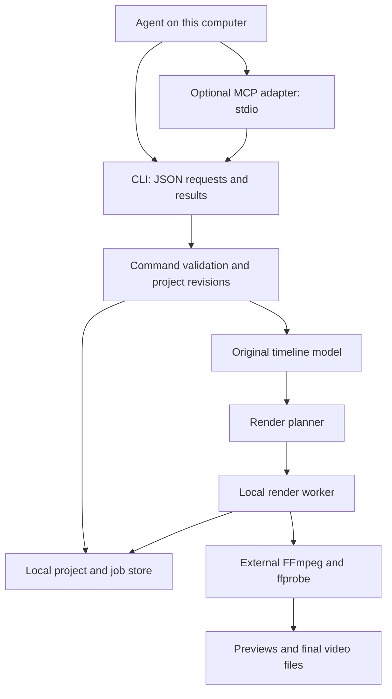

# Local engine architecture

This is the target design. A first crate now implements the rational-time model, pure snapshot edits, local JSON CLI, source inspection, and a narrow synchronous reference renderer. See [USAGE.md](USAGE.md) for the actual current contract. The `store` module now implements local SQLite sessions, durable idempotency, revision conflicts, semantic diffs and persistent undo/history. The `jobs` module adds a persisted Windows queue, progress, cancellation and worker interruption detection. The `mcp` module shares `commands` with the CLI over stdio. Video previews, automatic render retries and the module split below remain future work. The command table below is a target design; current contracts are in USAGE.md and AGENT_INTERFACE.md.

## Component layout



No HTTP layer, listening network port, cloud database, hosted queue, or third-party editing application runtime is required. The optional MCP adapter is a process started by the agent's client. It shares the engine contract instead of defining different editing semantics. Rust clients can call the core library directly; Python bindings can initially wrap the CLI.

The original engine owns timeline semantics, state changes, render planning, caching, inspection, and job control. The first backend delegates decoding, filtering, encoding, and muxing to local FFmpeg processes. This produces a usable engine sooner while preserving a boundary for later native or GPU implementations. FFmpeg documents the relevant trim, timestamp, compositing, and audio filter primitives. [FFmpeg filter reference](https://ffmpeg.org/ffmpeg-filters.html)

The agreed PixelForge/Qwen pilot adds a separate local production coordinator and optional file adapters, described in [YOUTUBE_PIPELINE.md](YOUTUBE_PIPELINE.md) and the [draft production contract](pipeline/CONTRACT.md). PixelForge recipes, neural model runtimes, generation receipts and review state stay outside the core timeline schema. Existing `session.*` receipts cover timeline mutations; generation/render-stage recovery needs its own implementation and evidence. The coordinator is a local process, not a listening service.

## Proposed modules

| Module | Responsibility |
| --- | --- |
| `cutbolt-core` | Time arithmetic, project schema, operations, validation, revisions |
| `cutbolt-media` | Tool capability detection, probing, asset identities, proxies |
| `cutbolt-render` | Intermediate render graph, execution, progress, cancellation, manifests |
| `cutbolt-cli` | JSON command transport and machine-readable output |
| `cutbolt-mcp` | Optional stdio tool adapter, implemented after the core contract stabilizes |
| `cutbolt-interop` | Optional native-format migrations and editorial interchange adapters |

Create these directories when implementing them; empty scaffolding is unnecessary now.

## Project and time model

- A project has a schema version, stable identifier, monotonic revision, media registry, and one or more sequences. The MVP edits one sequence at a time.
- A sequence declares output frame rate, dimensions, pixel aspect ratio, SDR color interpretation, audio sample rate, and channel layout.
- A clip references immutable media identity and separate source and timeline ranges. Relinking creates a recorded change, never an unnoticed replacement.
- Ranges are half-open: `[start, end)`. A clip that ends at a cut does not also own the next frame.
- API times use rational seconds, for example `{"num": 1001, "den": 30000}`. Fractions are reduced, denominators must be positive, arithmetic is overflow-checked, and values outside the supported JSON integer range are rejected.
- Frame and sample positions convert through rational rates. Snapping requires an explicit rounding rule. Drop-frame timecode is a display convention, not a different elapsed-time clock.
- Transitions consume defined handles around neighboring source ranges. Reject insufficient handles; do not silently freeze frames.
- Linked video/audio moves are explicit. A caller must opt into unlinking or changes that alter synchronization.
- Unknown schema versions, effect types, and unsupported parameters fail validation with structured details.

Use immutable canonical project snapshots plus a local SQLite store for current revision, edit history, idempotency records, and jobs. Commit each mutation and its idempotency record in one database transaction. Limit writing to one transaction at a time; detect conflicts using the supplied base revision. A native project export is a portable JSON snapshot with relative media references where practical, not a copy of its media.

## Agent command surface

| Proposed command | Purpose |
| --- | --- |
| `capabilities` | Report schema, operations, codecs, limits, and local tool versions |
| `media.inspect` | Register/probe allowed local inputs and return technical metadata |
| `project.create`, `project.inspect` | Create a project or return a bounded summary |
| `timeline.validate` | Check a hypothetical edit batch and return a semantic diff |
| `timeline.apply` | Atomically apply a batch against a known revision |
| `project.undo` | Create a new revision restoring a selected prior state |
| `preview.frame`, `preview.contact_sheet` | Return local artifact paths and exact timeline positions |
| `audio.inspect` | Return audio peaks and alignment information |
| `render.start`, `job.status`, `job.cancel` | Submit and control local render work |

Large timelines must support selection by sequence, track, clip IDs, and time range, plus pagination. An agent should not have to load every clip to trim one. Preview results return file references, not huge inline frame arrays. Later transcript or vision tools can attach findings with time ranges, but are not required by the engine.

Illustrative request only; this is not an executable command yet:

```json
{
  "schema_version": 1,
  "command": "timeline.apply",
  "request_id": "edit-0007",
  "project_id": "project-01",
  "expected_revision": 6,
  "operations": [
    {
      "op": "clip.split",
      "clip_id": "clip-03",
      "at_timeline_time": {"num": 5, "den": 1}
    }
  ]
}
```

Every mutation returns the new revision, changed IDs, a small semantic diff, warnings, and an undo reference. Validate the entire batch before applying any part. A failed batch creates no revision. A dry run creates no state or job side effects.

Idempotency keys are scoped to a project and store the normalized request hash and result. Check a recorded key before revision validation: a retry after a lost response must return the original result even if the project has since advanced. Reusing a key with different arguments fails explicitly. State changes and durable results share the same commit.

Errors include a stable code, field or operation index, explanatory text, relevant IDs, and whether retry is appropriate. Examples: `REVISION_CONFLICT`, `MISSING_MEDIA`, `INVALID_RANGE`, `INSUFFICIENT_HANDLES`, `UNSUPPORTED_EFFECT`, `UNSUPPORTED_COLOR`, `TOOL_MISSING`, and `DISK_FULL`. Only diagnostics go to stderr; stdout is reserved for protocol output. MCP can expose structured results using its tool mechanism. [MCP tools specification](https://github.com/modelcontextprotocol/modelcontextprotocol/blob/main/docs/specification/2026-07-28/server/tools.mdx)

## Rendering and local storage

1. Resolve a fixed project revision and media identities. Record tool versions and selected output settings.
2. Validate all media, editing operations, transforms, and output capabilities before encoding.
3. Build an intermediate render graph with explicit decode, trim, timestamp normalization, transform, composite, mix, and encode stages.
4. Schedule the job in the local store and run a worker under bounded CPU, memory, and disk policies.
5. Write to a temporary output in the destination filesystem. Validate completion, then atomically publish the final file. Preserve user source files and existing outputs unless an explicit overwrite operation was requested.
6. Store the manifest and artifact references. A failed or interrupted job cannot become `completed` merely because a partial file exists.

Job states: `queued`, `running`, `completed`, `failed`, `cancelled`, and `interrupted`. A supervisor detects dead workers and marks running jobs interrupted. The CLI may exit after submission while a local child process continues the job; this does not require an installed service. Cancellation must stop the worker's process tree, not only the parent process. Restart from a stable plan is the first recovery mechanism; arbitrary resume in the middle of a codec stream is deferred.

Keep state/cache under a local application-data directory and render output in a caller-selected directory. No runtime files belong in the source repository. Cache keys include source content identity, stream selection, relevant timeline subtree, output parameters, engine/backend versions, and color settings. Start with inspection/proxy/preview caches; cache eviction must never delete originals or final user outputs.

Use argument arrays, checked paths, explicit media roots, network-disabled media protocols where supported, and bounded probe/decode processes. Metadata and filenames are data, never agent instructions or shell fragments. Resource limits and process isolation reduce exposure to malformed media but are not a complete operating-system sandbox.

## Fidelity and extensibility

Define one supported SDR profile first, including transfer function, matrix, range, compositing space, and alpha rules. Handle missing metadata through a visible configured assumption or a rejection. Preview/export use the same operation definitions. A low-resolution preview can differ in sampling quality but must preserve timing and composition.

Audio mixing uses a declared floating-point working format and explicit channel mapping, resampling, gain, and final limiting/clipping policy. Fixture tests verify that timeline cuts and audio impulses remain aligned after resampling.

OTIO is a later editorial interchange adapter, not the media renderer. It describes clips, timing, tracks, transitions, and external media references; the engine still needs its own supported rendering semantics. [OpenTimelineIO overview](https://opentimelineio.readthedocs.io/en/latest/)

Future GPU work must retain a CPU reference path and declared numerical tolerances. Adding native FFmpeg bindings, GPU compositing, effects plugins, or distributed execution should follow measured requirements, not enlarge the first implementation by default.
