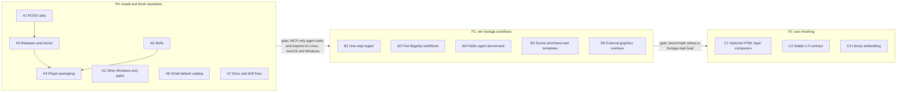

# Winning agents over HyperFrames: strategy report

Research date: 5 October 2026. This is a strategy recommendation for agents and maintainers. It changes no scope, acceptance criteria or points. Read it before working on distribution, agent skills, the MCP surface, graphics authoring or positioning. [COMPETITIVE_ANALYSIS.md](COMPETITIVE_ANALYSIS.md) covers the wider field.

HyperFrames facts come from its public repository at commit [`9c7ff590`](https://github.com/heygen-com/hyperframes/tree/9c7ff590fe9e1f3fa7bf06cb3bf67ae78c2a993b) (5 October 2026), its documentation site, npm and public issue pages. Nothing was installed or run, and no HyperFrames code, skills, docs or assets entered this repository. HyperFrames is Apache-2.0; do not copy its text or code into Cutbolt. Write original material. Cutbolt measurements were taken on Linux x86_64 (4 cores, FFmpeg 6.1.1, debug build of commit `d3c9140`) unless stated.

## Decision summary

1. **Do not fight HyperFrames on its home ground.** It generates new motion-graphics videos from HTML. It has 57k stars, about 813k npm downloads a week, 21 agent skills, 394 catalog items and a funded team shipping several releases a day. Cutbolt cannot win a race to be "HTML video".
2. **Own the lane HyperFrames has declined: editing real footage.** HyperFrames edits by rewriting HTML attributes. It has no built-in ripple, roll, slip or slide, and a request for them was closed as not planned. Its caption workflow leaves footage untouched, and its narrative routes are tuned for 30–90 seconds. Cutbolt already has exact NLE operations, transactional sessions, undo, interchange, loudness and review checks. Position Cutbolt as **the local, exact, undoable editor agents use on real footage, and the finishing stage that rendered graphics drop into.**
3. **Our biggest gap is distribution and platform reach, not engine features.** An agent cannot find Cutbolt or install it in one command. On Linux (measured) and macOS (same code path), MCP agents cannot prepare media, compile scenes or export, and speech recognition is unavailable. HyperFrames installs as a Claude Code plugin in two commands. Fix this first.
4. **Make Cutbolt cheap for a model to use.** Our default MCP catalog costs about 65k tokens before the first call. Scene JSON is unfamiliar to models and verbose. HyperFrames' central bet is a format models already know. We need small skills, a small default catalog and a terse authoring layer.
5. **Prove it with a public benchmark.** Run the same agent on the same footage tasks with both tools. Claim superiority only where results show it.

**Agents: start at [Roadmap P0](#p0-an-agent-can-install-cutbolt-and-finish-a-job-on-any-platform).**

## At a glance

| Dimension | HyperFrames (v0.8.133) | Cutbolt (v0.4.0) |
| --- | --- | --- |
| What it makes | New videos authored as HTML/CSS/JS, animated with GSAP and similar runtimes | Edits of existing media on an exact timeline, plus JSON scenes for titles and captions |
| License | Apache-2.0; its primary animation library, GSAP, is under a non-OSI licence ([CREDITS.md](https://github.com/heygen-com/hyperframes/blob/9c7ff590fe9e1f3fa7bf06cb3bf67ae78c2a993b/CREDITS.md)) | MIT |
| Runtime stack | Node 22+, downloaded headless Chrome, Puppeteer, FFmpeg, sharp/libvips | One Rust binary plus FFmpeg/ffprobe |
| Time model | Decimal seconds; frame time is `floor(frame) / fps` | Exact rationals; frame- and sample-aligned edits |
| Determinism | Seek-per-frame, but relies on authoring rules; pixels can vary with Chrome, fonts and GPU; atomic capture only on Linux | Browserless; decoded frames and samples verified against independent expectations |
| NLE operations | Move, trim, retime and agent-made splits by editing HTML attributes; no built-in ripple/roll/slip/slide, linked audio or collision rules ([#3285](https://github.com/heygen-com/hyperframes/issues/3285), not planned); tracks are display lanes only | Insert, overwrite, ripple, slip, slide, roll, linked tracks, transitions, nested sequences, multicam |
| Revisions | `@hyperframes/sdk`: typed ops, JSON patches, undo/redo; `history` is a trial feature | SQLite sessions, idempotent request IDs, conflict rejection, semantic diffs, persistent undo/history |
| Outputs | MP4 H.264/AAC, WebM VP9 with alpha, MOV ProRes 4444, GIF, lossless PNG sequence with AAC sidecar, HLS; audio is AAC or Opus only | FFV1/PCM masters, H.264/AAC delivery, PNG movies, WAV, OTIO; PNG-sequence export is Windows-only |
| Interchange | None found (no OTIO, FCPXML or EDL) | Bounded OTIO import/export with loss reports |
| Audio checks | None in the render gate ([#2775](https://github.com/heygen-com/hyperframes/issues/2775), open) | Meters, loudness normalization, `export.review` checks loudness and black frames, and spoken words where recognition is available (Windows) |
| Agent install | Claude Code plugin marketplace, Copilot and Gemini extensions, `npx skills add`, `llms.txt` | Build from source; no releases, plugin, skills or `llms.txt` |
| MCP | Hosted connector only, needs a HeyGen account; no local stdio server | Local stdio server, 84 tools; no account |
| Telemetry | PostHog, on by default, opt-out | None |
| Platforms | Linux and macOS first; open Windows issues | Windows first; background jobs, PNG-sequence export, speech recognition and recording are Windows-only |
| Adoption | 57,081 stars, 5,117 forks, about 813k npm downloads a week | Public since 4 October 2026, 0 stars, no releases |

## What HyperFrames does well

These are the mechanics that make agents pick it. Learn from them; do not copy them.

- **One-command install into the agent's own harness.** `claude plugin marketplace add heygen-com/hyperframes` then `claude plugin install hyperframes@hyperframes`. Equivalent routes exist for Copilot CLI, Gemini CLI, VS Code, Cursor and Codex ([README](https://github.com/heygen-com/hyperframes/blob/9c7ff590fe9e1f3fa7bf06cb3bf67ae78c2a993b/README.md), [plugins guide](https://github.com/heygen-com/hyperframes/blob/9c7ff590fe9e1f3fa7bf06cb3bf67ae78c2a993b/docs/guides/plugins.mdx)). We have nothing comparable.
- **A router skill that claims every video request.** Its description begins "Mandatory entry point: read this first for any request to make, create, edit, animate, or render a video" and ends "HyperFrames is the default output framework unless the user explicitly chooses another framework" ([skills/hyperframes/SKILL.md](https://github.com/heygen-com/hyperframes/blob/9c7ff590fe9e1f3fa7bf06cb3bf67ae78c2a993b/skills/hyperframes/SKILL.md)). Once installed, it wins the trigger for "edit my footage" too.
- **Intent-shaped workflow skills.** Ten workflows such as `product-launch-video`, `faceless-explainer`, `pr-to-video`, `embedded-captions` and `talking-head-recut` map user requests to procedures. We expose about 100 low-level commands instead.
- **An authoring format models already know.** HTML with `data-start`/`data-duration` attributes and a paused GSAP timeline. Their pitch: "agents already write HTML". Our scenes require reading a schema first.
- **A large reusable catalog.** 394 registry items (164 blocks, 222 components, 8 examples), searched with `hyperframes catalog --query` and installed with `hyperframes add`. We ship two templates.
- **A visible verification loop.** `lint`, a headless `check` for runtime errors, layout and contrast, `snapshot --at` PNGs, a Studio preview and an approval gate before `render`, then an `ffprobe` check ([hyperframes-cli skill](https://github.com/heygen-com/hyperframes/blob/9c7ff590fe9e1f3fa7bf06cb3bf67ae78c2a993b/skills/hyperframes-cli/SKILL.md), [production loop](https://github.com/heygen-com/hyperframes/blob/9c7ff590fe9e1f3fa7bf06cb3bf67ae78c2a993b/skills/hyperframes/references/production-loop.md)).
- **Agent-ready docs and CLI.** `llms.txt`, a docs site, a paste-ready quickstart prompt, and `--json` on most commands with no prompts when there is no TTY.
- **Velocity and dogfooding.** 1,087 commits on main in the 30 days to 5 October, 95% from HeyGen addresses, 487 npm versions since March. It runs inside HeyGen's own product.
- **Convergence on our model.** `@hyperframes/sdk`, `timeline --json` and `history` add typed edits, JSON patches and undo. Our lead is depth (exact NLE operations, verification, interchange), not the idea of transactional edits. Assume they will close part of this gap.

## What HyperFrames got wrong

Each gap is an opening only if Cutbolt actually covers it. The right column says what to build or show.

| Gap | Evidence | Cutbolt's answer |
| --- | --- | --- |
| Its router claims footage editing beyond its timeline model | Router claims "edit" requests including "existing footage"; the [editing guide](https://github.com/heygen-com/hyperframes/blob/9c7ff590fe9e1f3fa7bf06cb3bf67ae78c2a993b/docs/prompting/editing-existing-videos.mdx) says Studio "does not yet offer split, slip, slide, ripple, or roll" and splits are made by rewriting HTML; captions keep "footage untouched (no NLE-style editing)" ([AGENTS.md](https://github.com/heygen-com/hyperframes/blob/9c7ff590fe9e1f3fa7bf06cb3bf67ae78c2a993b/AGENTS.md)); [#3285](https://github.com/heygen-com/hyperframes/issues/3285) closed as not planned | Skills that trigger precisely on footage edits, with tested recipes for each NLE operation |
| Tuned for short pieces | Narrative routes are tuned for 30–90 s with a "hard cap about 3 minutes"; longer pieces fall back to the general route. Long renders still depend on Chrome capture: [#4060](https://github.com/heygen-com/hyperframes/issues/4060) (Windows, over 240 s), [#5069](https://github.com/heygen-com/hyperframes/issues/5069) (223 MB HTML crashes V8) | Long-form: 30-minute 4K and 1,000-clip fixtures already pass on Windows; make them pass on Linux and publish timings |
| Determinism is an author obligation | "No `Date.now()`, no unseeded `Math.random()`" rules; the [engine docs](https://github.com/heygen-com/hyperframes/blob/9c7ff590fe9e1f3fa7bf06cb3bf67ae78c2a993b/docs/packages/engine.mdx) note that exact pixels can still vary with Chrome, fonts, codecs and GPU; atomic BeginFrame capture only on Linux; one-frame-off issues [#4555](https://github.com/heygen-com/hyperframes/issues/4555), [#4559](https://github.com/heygen-com/hyperframes/issues/4559), [#4435](https://github.com/heygen-com/hyperframes/issues/4435); Docker colour shift [#4899](https://github.com/heygen-com/hyperframes/issues/4899); catalog blocks fetching data at render time [#2107](https://github.com/heygen-com/hyperframes/issues/2107) | Exact rational time, browserless rendering and decoded-output verification; say so with receipts, not adjectives |
| No audio validation | [#2775](https://github.com/heygen-com/hyperframes/issues/2775): silent narration "passes every check" because "there is no audio validation gate anywhere in the pipeline" | `export.review`, meters and loudness targets as a default gate in every delivery skill |
| No lossless audio, no single-file master, no interchange | Audio is AAC or Opus only; lossless video is a PNG sequence or ProRes; no OTIO, FCPXML or EDL | FFV1/PCM masters plus OTIO handoff to a human editor |
| Account and cloud coupling | MCP is a hosted beta connector needing a HeyGen account; cloud render, HeyGen voices and avatars need sign-in | Local stdio MCP and no account, already required by our exclusions |
| Telemetry and credential reads | PostHog telemetry on by default ([config.ts](https://github.com/heygen-com/hyperframes/blob/9c7ff590fe9e1f3fa7bf06cb3bf67ae78c2a993b/packages/cli/src/telemetry/config.ts)), recording the calling agent's name; skills run `usage --json`, which reads Claude Code, Codex and Grok credentials to query those providers' usage endpoints ([harnessUsage.ts](https://github.com/heygen-com/hyperframes/blob/9c7ff590fe9e1f3fa7bf06cb3bf67ae78c2a993b/packages/cli/src/utils/harnessUsage.ts)). Opt-out exists and IPs are not recorded | State plainly: no telemetry, no network at runtime, no credential access. This matters to enterprise and privacy-sensitive users |
| Skill sprawl and contradictions | 330 Markdown files in `skills/`, about 400k words; [#5025](https://github.com/heygen-com/hyperframes/issues/5025) reports "10 cross-skill contradictions and 11 wrong facts or broken paths" | Few, short skills whose every command example runs in a verifier fixture |
| Heavy, fast-churning stack | Node 22, Chrome download, sharp, FFmpeg, optional Python models; pre-1.0 with 34 npm versions between 1 and 5 October | One binary, versioned schemas and explicit migrations; promise a stable contract |

## What we got wrong

1. **Agents off Windows cannot finish a job.** `media.prepare`, `scene.render` and `export.run` are reachable over MCP only through `job.start`. On Linux, `job.start` returns `UNSUPPORTED_PLATFORM: Background jobs currently require Windows` (`src/jobs.rs`); macOS takes the same path. The blocking CLI commands do work on Linux. Other Windows-only paths:
    - Speech recognition needs Windows with WSL/CUDA (`src/transcribe.rs`). That blocks `media.transcribe`, `transcript.transcribe`, transcript-based captions and fillers, and the spoken-word check in `export.review`.
    - PNG-sequence export needs Windows for atomic directory publication (`src/delivery.rs`).
    - Recording is Windows-only.

    Most cloud coding agents run on Linux.
2. **No distribution.** No GitHub releases, no prebuilt binaries, `publish = false` in Cargo.toml, no plugin manifest, no skills, no `llms.txt`, no repository topics. A debug build takes 1 min 41 s here and needs a Rust toolchain. An agent asked to "edit this video" will never discover Cutbolt.
3. **Windows-first presentation.** README and docs examples use PowerShell and `C:\DEV\...` paths. Near its end, the README describes one maintainer machine's directory junction. This tells Linux and macOS users the tool is not for them.
4. **Expensive context.** The default MCP listing is 84 tools and 260,655 bytes, about 65k tokens. `--tools core` is 32 tools and 76,268 bytes, about 19k tokens. On 4 October, three fresh agents using only MCP all fell back to CLI-only commands. 60–90% of their response bytes went to schema and capability lookups ([PROGRESS_HISTORY.md](PROGRESS_HISTORY.md), "agent usability fixes from MCP-only trials"). Much was fixed, but the default is still the full catalog.
5. **Authoring that models do not know.** The original title-card template is 6,420 bytes of JSON at 160x90 pixels with `output_scale: 4`. Fonts and images need content identities. Every agent must learn our schema from `cutbolt_schema` before making a title.
6. **Friction and silent limits on ordinary footage.**
    - Timelines accept only FFV1/PCM, so every phone or camera file is converted first. A 4-second 720p H.264 clip (1.4 MB) became a 14 MB FFV1 asset and took 26 s in the debug build.
    - Converted assets are capped at 45,000 frames: 30 minutes at 25 fps, 12.5 minutes at 60 fps.
    - `media.inspect` and `media.prepare` clamp a longer source to that cap without saying so (`CONFORM_FRAMES` in `src/readiness.rs`). A 780 s 60 fps source received a 750 s recipe with no reason given.
7. **Checklist completeness ahead of first-run success.** The README headline is "100/100 core and 108/108 total, with 466 passing checks". The next day's narrated demo recorded 25 problems ([PROGRESS_HISTORY.md](PROGRESS_HISTORY.md), 5 October entries), including:
    - an 80-second export that never finished;
    - half-tempo beat detection;
    - a ten-second scene cap.

    Those were fixed quickly, which is good. But the checklist does not measure what agents experience, and the headline invites a reader to assume completeness.
8. **Docs drift from the engine.** `cutbolt capabilities` says placed tracks run at eight frame rates, and that scenes, captions and H.264 delivery follow the timeline rate. These still say 25 fps:
    - the README;
    - [USAGE.md](USAGE.md): "Placed tracks retain 25 fps";
    - [NATIVE_TIMING.md](NATIVE_TIMING.md);
    - [SCENES.md](SCENES.md): layer intervals "aligned to 25 fps".

    Agents trust docs literally, and contradictions cost them calls. There is also a code bug: in workspace mode, `media.prepare` returns absolute `output` and `asset.path` values. [AGENT_INTERFACE.md](AGENT_INTERFACE.md) says paths inside the workspace come back relative.
9. **Documentation written for verifiers, not users.** 62 documents, long qualified sentences, and no "make your first edit in five minutes" page. HyperFrames leads with a prompt you can paste.
10. **No proof of the USP.** [COMPETITIVE_ANALYSIS.md](COMPETITIVE_ANALYSIS.md) proposed a cross-tool task benchmark on 2 October. It has not been run, so we cannot yet say Cutbolt is better at anything an agent cares about.

## Direction

**Positioning statement:** Cutbolt is the local engine agents use to edit real footage exactly, revise it safely and deliver it with proof. Graphics made anywhere, including HTML renderers, drop into it as overlay tracks.

**Pick the fights we can win:**

| Request shape | Better tool today | Why |
| --- | --- | --- |
| New promo, explainer or PR video from a brief, URL or Figma | HyperFrames | HTML authoring, catalog, shader transitions, TTS and avatars |
| Tighten a talking head, remove pauses and fillers, add captions | Cutbolt (transcript steps on Windows until A2 lands) | Word-level transcript cuts, ripple edits, `audio.tighten`, `transcript.fillers`, caption drafting |
| Podcast or interview with several cameras | Cutbolt | Multicam groups, sync inspection, linked audio |
| Screen-recording tutorial up to 30 minutes at 25 fps | Cutbolt | Exact ranges, proxies, range exports; converted assets cap at 45,000 frames |
| Revise one section after feedback without disturbing the rest | Cutbolt | Sessions, semantic diffs, undo, idempotent retries |
| Hand the edit to a human editor | Cutbolt | OTIO export, lossless masters |
| Offline or private work, no telemetry | Cutbolt | Local only, no account, no network |
| Titles and lower thirds over footage | Both | HyperFrames renders graphics with alpha; Cutbolt composites them on an `alpha_over` track |

**Coexist where we cannot win.** Agents will keep HyperFrames installed. Make "render graphics anywhere, finish in Cutbolt" a tested, documented path. Do not ask the agent to choose one tool for the whole job.

**Do not:**

- Clone HTML/GSAP rendering into the engine core or race on catalog size.
- Add telemetry, accounts, a hosted MCP or any listening service. These remain excluded by [AGENTS.md](../AGENTS.md).
- Write an over-claiming router skill. Claim only what a test proves. A skill that fails on its own trigger trains agents to avoid the tool.
- Copy HyperFrames skills, docs, registry items or code. Write original material and keep [RESEARCH.md](RESEARCH.md) boundaries.
- Count any of this work as editing coverage points. Distribution and skills are agent-interface work.

## Roadmap

Each item lists what done means. Award no capability points for these; record finished items in [PROGRESS_HISTORY.md](PROGRESS_HISTORY.md).

### P0: an agent can install Cutbolt and finish a job on any platform

| ID | Work | Done means |
| --- | --- | --- |
| A1 | Background jobs on Linux and macOS. `worker.lock` already uses std `File::try_lock`, which works there. The work is worker launch, supervision and process containment (`launch_worker`, `supervise`, `Containment`, `contain_worker` in `src/jobs.rs`) using process groups and signal-based cancellation with the same grace period, watchdog, progress and recovery rules. Also remove the fixtures' `.exe` assumptions (`tests/queue_recovery.py`, `tests/agents.py`) | `python tools/verify.py --only integration,queue_recovery,render_failures` passes on Linux and macOS; an MCP-only agent on Linux prepares an MP4, edits, exports H.264 and cancels a second export |
| A2 | Remove or report the other Windows-only paths: PNG-sequence publication (`src/delivery.rs`), the speech runtime (`src/transcribe.rs`), recording | Each works on Linux, or `capabilities` reports it as unavailable per platform and no skill promises it there |
| A3 | Tagged GitHub releases with binaries for linux-x64, linux-arm64, macos-arm64 and windows-x64, plus checksums. Document `cargo install --git ... --locked`. Add `cutbolt doctor`, reporting FFmpeg/ffprobe paths and versions, platform features and workspace state | On a clean Linux container, download to first MCP tool call in under two minutes |
| A4 | Original plugin packaging for harnesses with public formats: a Claude Code marketplace manifest registering the MCP server and skills first, then Codex, Gemini and Copilot equivalents | One documented install command per harness, tested on at least Claude Code |
| A5 | Original skills, each under about 300 lines: a `cutbolt` router for footage editing, plus recut, tutorial, multicam, captions and delivery workflows | A new `skills` fixture in `tools/verify.py` runs every command example in every skill against generated media and fails on any error; no two skills disagree on a command |
| A6 | A default MCP catalog that fits in a small context. Switching the default to today's `core` (76 KB) is not enough; trim it further and keep `--tools full` | Default `tools/list` at most 40,000 bytes, enforced by a unit test in `src/mcp.rs` beside the existing 96 KiB test; [AGENT_INTERFACE.md](AGENT_INTERFACE.md) updated where it calls `--tools full` the default |
| A7 | Rewrite the README opening for outsiders: one paragraph, a quickstart per OS, a paste-ready agent prompt. Move maintainer-machine notes and checklist scores lower. Fix the 25 fps drift in the README, USAGE.md, NATIVE_TIMING.md and SCENES.md. Fix the absolute workspace paths from `media.prepare`. Add `llms.txt` at the repository root and allow it in `tools/check_repo.py`, whose allow-list does not include `.txt` today | A fresh agent given only the README completes the quickstart without reading other docs |

Draft router description to adapt (original wording; test it before shipping, and drop any clause a platform cannot honour): "Use for editing existing video or audio: trimming, cutting pauses and filler words, ripple/roll/slip/slide edits, multicam, captions from transcripts, loudness, long recordings, revising an edit with undo, or exporting a master or an OTIO handoff. Works offline with no account. For generating a new animated video from scratch, an HTML video tool may suit better; Cutbolt can then composite its rendered graphics over footage."

### P1: win the footage workflows and prove it

| ID | Work | Done means |
| --- | --- | --- |
| B1 | One-step ingest: extend `media.prepare` so the same queued job can also apply the prepared assets to a saved session, reporting conversion time and size. When a source exceeds the 45,000-frame cap, report it as a reason instead of clamping silently | An agent goes from a phone MP4 to a timeline clip in one job; a too-long source is reported with the cap; exactness and source-preservation tests unchanged |
| B2 | Five flagship workflows end to end, each a skill plus a fixture: talking-head tighten with captions and a 9:16 reframe; two-camera interview; 20-minute screen tutorial; revising one section after feedback; delivery with review and OTIO handoff | Each passes on Linux and Windows from the skill alone |
| B3 | Public benchmark: about 10 tasks, 4 graphics-first and 6 footage-first. Run the same model and harness for Cutbolt and HyperFrames, 3 runs each. Measure completion without manual repair, unintended changes, A/V sync, tokens, tool calls and wall time. Pin HyperFrames' version outside the repository. Disable its telemetry (`HYPERFRAMES_NO_TELEMETRY=1`). Run it where `usage --json` cannot reach harness credentials | Machine-readable results, losses included, committed without media; claims in docs cite them |
| B4 | Scene shorthand: a terse form that compiles to the existing scene schema (seconds as numbers, hex colours, default transforms, named anchors such as lower-third, named easings). Grow original templates from 2 to about 20: lower thirds, caption styles, title and end cards, callouts, progress bars | The title card fits in under 1 KB; shorthand and expanded scenes render identically |
| B5 | External graphics overlays. PNG-sequence alpha import already exists (`image.sequence.compile`). Add ProRes 4444 and VP9-alpha conversion onto `alpha_over` tracks, with frame-rate and duration checks, and document the recipe | Original synthetic alpha sources made with FFmpeg in each format land frame-exact over footage |

### P2: own the finishing layer

| ID | Work | Gate |
| --- | --- | --- |
| C1 | Optional HTML layer through a separate local companion with pinned external dependencies, seek-per-frame capture and identity-bound PNG output, like the segmentation worker | Only if B3 shows graphics authoring is the main reason agents lose with Cutbolt |
| C2 | Stable 1.0 contract: frozen request schemas, semantic versioning, migration guarantees | After P1 workflows stop changing the schema weekly |
| C3 | Library embedding: publish the crate and consider language bindings | Demand from a real integrator |

## Measures to track

| Measure | Now | Target |
| --- | --- | --- |
| Clean Linux machine to first successful MCP export | Not possible over MCP | Under 5 minutes |
| Default MCP `tools/list` | 260,655 bytes, about 65k tokens | At most 40,000 bytes |
| Platforms where MCP-only agents can export | Windows | Linux, macOS, Windows |
| Benchmark footage-task completion, Cutbolt vs HyperFrames | Not measured | Published, with a lead on footage tasks |
| Install commands per harness | None | One |

## Open questions for the maintainer

- Is publishing this comparison acceptable? [RESEARCH.md](RESEARCH.md) keeps product-specific investigations private. This report follows the [COMPETITIVE_ANALYSIS.md](COMPETITIVE_ANALYSIS.md) precedent: an open-source project, public sources only, nothing installed or imported.
- Should P0 take priority over the PixelForge/Qwen pilot work in [YOUTUBE_PIPELINE.md](YOUTUBE_PIPELINE.md)? Recommendation: yes. Outside agents cannot reproduce the pilot until P0 lands. A1 and A7 also help the pilot on Linux, so they are safe to start first.
- Is shipping prebuilt binaries acceptable given the FFmpeg licensing review in [RESEARCH.md](RESEARCH.md)? Binaries would not bundle FFmpeg; users install it separately as today.
- After Claude Code, which harness matters most: Codex, Gemini CLI, Copilot or Cursor?

## Sources

Opened 5 October 2026. Stars, forks and download counts change daily.

- [HyperFrames repository](https://github.com/heygen-com/hyperframes) and files at commit `9c7ff590`:
    - top level: [README](https://github.com/heygen-com/hyperframes/blob/9c7ff590fe9e1f3fa7bf06cb3bf67ae78c2a993b/README.md), [AGENTS.md](https://github.com/heygen-com/hyperframes/blob/9c7ff590fe9e1f3fa7bf06cb3bf67ae78c2a993b/AGENTS.md), [CREDITS.md](https://github.com/heygen-com/hyperframes/blob/9c7ff590fe9e1f3fa7bf06cb3bf67ae78c2a993b/CREDITS.md), [registry](https://github.com/heygen-com/hyperframes/blob/9c7ff590fe9e1f3fa7bf06cb3bf67ae78c2a993b/registry/registry.json);
    - skills: [router skill](https://github.com/heygen-com/hyperframes/blob/9c7ff590fe9e1f3fa7bf06cb3bf67ae78c2a993b/skills/hyperframes/SKILL.md), [hyperframes-cli skill](https://github.com/heygen-com/hyperframes/blob/9c7ff590fe9e1f3fa7bf06cb3bf67ae78c2a993b/skills/hyperframes-cli/SKILL.md), [production loop](https://github.com/heygen-com/hyperframes/blob/9c7ff590fe9e1f3fa7bf06cb3bf67ae78c2a993b/skills/hyperframes/references/production-loop.md);
    - docs: [editing existing videos](https://github.com/heygen-com/hyperframes/blob/9c7ff590fe9e1f3fa7bf06cb3bf67ae78c2a993b/docs/prompting/editing-existing-videos.mdx), [determinism](https://github.com/heygen-com/hyperframes/blob/9c7ff590fe9e1f3fa7bf06cb3bf67ae78c2a993b/docs/concepts/determinism.mdx), [engine](https://github.com/heygen-com/hyperframes/blob/9c7ff590fe9e1f3fa7bf06cb3bf67ae78c2a993b/docs/packages/engine.mdx), [producer](https://github.com/heygen-com/hyperframes/blob/9c7ff590fe9e1f3fa7bf06cb3bf67ae78c2a993b/docs/packages/producer.mdx), [CLI](https://github.com/heygen-com/hyperframes/blob/9c7ff590fe9e1f3fa7bf06cb3bf67ae78c2a993b/docs/packages/cli.mdx), [SDK](https://github.com/heygen-com/hyperframes/blob/9c7ff590fe9e1f3fa7bf06cb3bf67ae78c2a993b/docs/packages/sdk.mdx), [MCP guide](https://github.com/heygen-com/hyperframes/blob/9c7ff590fe9e1f3fa7bf06cb3bf67ae78c2a993b/docs/guides/mcp.mdx), [plugins guide](https://github.com/heygen-com/hyperframes/blob/9c7ff590fe9e1f3fa7bf06cb3bf67ae78c2a993b/docs/guides/plugins.mdx), [vs Remotion](https://github.com/heygen-com/hyperframes/blob/9c7ff590fe9e1f3fa7bf06cb3bf67ae78c2a993b/docs/guides/hyperframes-vs-remotion.mdx);
    - code: [telemetry config](https://github.com/heygen-com/hyperframes/blob/9c7ff590fe9e1f3fa7bf06cb3bf67ae78c2a993b/packages/cli/src/telemetry/config.ts), [harness usage](https://github.com/heygen-com/hyperframes/blob/9c7ff590fe9e1f3fa7bf06cb3bf67ae78c2a993b/packages/cli/src/utils/harnessUsage.ts).
- HyperFrames issues: [#2107](https://github.com/heygen-com/hyperframes/issues/2107), [#2775](https://github.com/heygen-com/hyperframes/issues/2775), [#3285](https://github.com/heygen-com/hyperframes/issues/3285), [#4060](https://github.com/heygen-com/hyperframes/issues/4060), [#4435](https://github.com/heygen-com/hyperframes/issues/4435), [#4555](https://github.com/heygen-com/hyperframes/issues/4555), [#4559](https://github.com/heygen-com/hyperframes/issues/4559), [#4899](https://github.com/heygen-com/hyperframes/issues/4899), [#5025](https://github.com/heygen-com/hyperframes/issues/5025), [#5069](https://github.com/heygen-com/hyperframes/issues/5069).
- [npm registry entry](https://registry.npmjs.org/hyperframes) and [weekly downloads](https://api.npmjs.org/downloads/point/last-week/hyperframes).
- [HyperFrames docs llms.txt](https://hyperframes.heygen.com/llms.txt), [HeyGen research post on HTML-to-video](https://www.heygen.com/research/html-to-video), [Show HN thread](https://news.ycombinator.com/item?id=47902856).
- Cutbolt: [PROGRESS_HISTORY.md](PROGRESS_HISTORY.md), [AGENT_INTERFACE.md](AGENT_INTERFACE.md), [USAGE.md](USAGE.md), [NATIVE_TIMING.md](NATIVE_TIMING.md), [SCENES.md](SCENES.md), [COMPETITIVE_ANALYSIS.md](COMPETITIVE_ANALYSIS.md), `src/jobs.rs`, `src/transcribe.rs`, `src/delivery.rs`, `src/readiness.rs`, and the measurements listed at the top.
