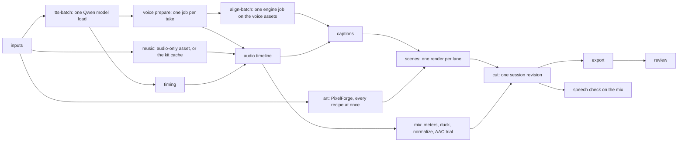

# Productions from a manifest

`tools/production.py` turns one JSON manifest into a narrated, captioned, mixed and reviewed 1080p25 H.264 video. The manifest holds:
- the script, one line per scene;
- one visual beat per scene;
- a palette, motion patterns, music and delivery settings.

One command runs every stage as a durable, resumable job with stage receipts:
1. PixelForge art;
2. Qwen narration;
3. alignment;
4. scenes with word-cued layers;
5. `media.prepare`;
6. assembly;
7. captions;
8. ducking and loudness;
9. export;
10. review.

An agent writes the manifest, runs `build`, and looks at the review sheet. In the 5 October 2026 progress demo the same kind of video took about 170 MCP calls and 75 minutes of authoring.

This is the "local workflow coordinator" of the [YouTube pipeline](YOUTUBE_PIPELINE.md). It implements the [production contract](pipeline/CONTRACT.md) as `cutbolt-production-1`; see [what it covers](#contract-coverage).

## Engine command or local coordinator: the decision

The production step is a **local coordinator tool that drives the engine**, not an engine command such as `production.build`. The reasons:

1. **The documented architecture puts it there.** [YOUTUBE_PIPELINE.md](YOUTUBE_PIPELINE.md) draws the coordinator beside Cutbolt, PixelForge and Qwen, owning scene dependencies, stage receipts, reviews and resumption through a local file/state contract. The [contract](pipeline/CONTRACT.md) has it "translate between public interfaces". An engine command would make Cutbolt own companion formats: PixelForge recipes, the Qwen request and the WSL environment.
2. **No orchestration fields leak into other documents.** The coordinator's state lives in its own `state/` folder. PixelForge recipes and Cutbolt snapshots stay exactly what those tools define. The engine sees ordinary requests.
3. **Companions stay external and replaceable.** PixelForge runs as its CLI and Qwen as a separate worker process in its own environment. A supplied WAV or scene recipe enters through the same stages ([overrides](#overriding-a-stage)). None of this needs a new engine dependency or engine-side process launching of third-party tools.
4. **The engine's durability is reused, not duplicated.** Long engine work (alignment, preparation, scene renders, export, review) runs through the engine's own job queue. Request IDs derive from each stage's key, so a coordinator that dies leaves its jobs running, and the next run collects them by request ID instead of starting them again. Timeline changes go through `session.create`/`session.apply` with deterministic request IDs and revision checks.
5. **It keeps the shared engine surface small.** The MCP catalog is close to its size budget, and `commands.rs`, `jobs.rs` and `mcp.rs` are edited by several sessions. The only engine change is one sentence in the MCP instructions pointing agents here.
6. **The template is code.** Turning the demo's art generator and scene builder into a reusable template is design work: clouds that drift, cards that land on words, a highlight that follows a film strip. That is easier to evolve as original Python, beside the existing `tools/pixelforge_handoff.py`, than as Rust in the engine.

Costs of this choice, recorded as open gaps:
- A host that can only reach Cutbolt over MCP, with no shell, cannot start a production.
- The coordinator is a second local process with its own state format, documented below.

## Quick start

1. **Local tools.** A config file names this machine's tools; it is not production data, so keep it outside Git:

   ```json
   {
    "engine": "C:\\DEV\\Cutbolt\\target\\release\\cutbolt.exe",
    "ffmpeg": "C:\\ffmpeg\\bin\\ffmpeg.exe", "ffprobe": "C:\\ffmpeg\\bin\\ffprobe.exe",
    "pixelforge": {"node": "node", "script": "C:\\DEV\\PixelForge\\bin\\pixelforge.js"},
    "tts": {"distribution": "Ubuntu", "python": "/usr/bin/python3",
            "python_paths": ["/home/me/.local/share/cutbolt-qwen-tts-20261003/packages"],
            "model": "/home/me/.cache/cutbolt-models/Qwen3-TTS-12Hz-0.6B-CustomVoice/85e237c12c027371202489a0ec509ded67b5e4b5",
            "revision": "85e237c12c027371202489a0ec509ded67b5e4b5", "batch_size": 8},
    "speech_runtime": {"distribution": "Ubuntu", "python": "/usr/bin/python3", "python_paths": ["..."],
                       "model": "C:\\...\\small.pt", "threads": 2, "alignment_root": "C:\\...\\ctc-models\\en\\..."},
    "lanes": 6,
    "cache": "C:\\DEV\\CutboltData\\production-kit-cache"
   }
   ```

   - `speech_runtime` is the engine's [transcription runtime](TRANSCRIPTS.md); alignment and the speech check use it.
   - `tts.model` is the pinned CustomVoice snapshot from [YOUTUBE_PIPELINE.md](YOUTUBE_PIPELINE.md#preset-speaker-model-customvoice). A copy on the WSL distribution's own disk loads in about 12-17 s instead of 34-44 s from `/mnt/c`.
   - `lanes` is how many engine job queues run at once (scene renders, voice preparation).
   - `cache` is an optional kit cache: a music bed that had to be resampled is kept once per music file and engine build, so later productions in the same style copy it instead of converting it again. A 48 kHz stereo bed is used as it is and never cached.
2. **A manifest.** For example, [example.production.json](pipeline/example.production.json) is the six-scene pilot with every beat type. Inputs (music, fonts, supplied takes) are absolute local paths. The coordinator copies each one, by content, into the production's `sources/`.
3. **Check, then build:**

   ```powershell
   python tools/production.py check my-film.production.json
   python tools/production.py build my-film.production.json --root C:\DEV\CutboltData\my-film --config C:\DEV\CutboltData\production-config.json
   ```

   `check` validates the manifest and lists its scenes, art recipes and labels without running anything. It also estimates the film's length (see [warnings](#warnings)). `build` prints one JSON object, `{"ok": true, "result": ...}` or `{"ok": false, "error": {code, message, stages, warnings}}`, with progress lines on stderr. The result holds:
   - the export path, duration and scene boundaries;
   - the review summary and the speech check;
   - `mix`: the limiter ceiling, the AAC true peak it was chosen for, and why the AAC trials stopped (`aac_stopped`);
   - `warnings`: what the checks found, also printed on stderr as `WARNING` lines;
   - the saved project revision;
   - which stages were built or reused, and how long each took.

   `"ok": true` means every stage ran, not that the delivery is right. Read `warnings`, then look at `reviews/review-*/sheet.png`.
4. **Inspect or revise.**
   - `status --root DIR` lists every stage's state, the last build with its warnings, and the review gates.
   - `show STAGE --root DIR` prints one receipt, for example `show timing` or `show scene:s2`.
   - `resolve MANIFEST SCENE --root DIR [--still T ...]` resolves a hand-written scene from the last build's take and renders stills of it, without a build ([previewing](#previewing-a-hand-written-scene)).
   - Edit the manifest and run `build` again: only stages whose inputs changed run.

## The manifest (`cutbolt-production-1`)

Unknown fields fail with the field named; nothing is guessed. Times are exact seconds: `3`, `"6/25"`, `"0.24"` or `{"num", "den"}`.

| Field | Meaning |
| --- | --- |
| `contract_version` | `"cutbolt-production-1"` |
| `production_id` | 1-48 lowercase letters, digits or `-`. It is also the saved project's ID. |
| `title`, `notes` | Free text, recorded only |
| `template` | `{"id": "pixel-stage-explainer", "version": 1}`, the only template so far |
| `language` | `"en"`, used for alignment and the speech check |
| `inputs` | Map of name to absolute local file, or to a numbered [image sequence](#image-sequences), `{"sequence": "C:\\...\\track_####.png"}`. Network paths, relative paths and alternate data streams are refused. |
| `fonts` | `{"bold": <input>, "regular": <input>}`, TrueType or OpenType, for captions and the end card |
| `voice` | `speaker` (a CustomVoice preset such as `ryan`), `language` (`English`), `seed`, optional `instruct`, and `split`: `none` (default, each line in one breath) or `sentence` (each sentence on its own, joined by `pause`, default 0.3 s) |
| `music` | `null`, or `input` (a PCM16 WAV), `bpm`, `bed_db_under_voice` (default 6), `duck_milli` (default 300), `fade_out` (default 1.92 s), `loop`: `none` (default; the bed plays once) or `bars` (it repeats on whole bars, which needs `bpm`; see [music](#music-beds)) |
| `palette` | Optional overrides of the template's [named colours](#palette-slots), as `#rrggbb` |
| `patterns` | Custom motions: name to `[[pose, frames at 25 fps], ...]` |
| `timing` | `lead` before each line (default 0.24 s), `tail` after it (0.4 s), `snap` (`frame`, `beat` or `bar`; default `beat` with a tempo, else `frame`), `title_bars` (2), `end_min_bars` (4), `min_scene` (3 s) |
| `delivery` | `captions` (`burn_in` true; `sidecars` `["srt", "vtt"]`; `line_chars` 40; `lines` 2); `loudness_lkfs` (-14); `peak_dbfs` (-1), the delivered file's highest true peak; `review` (`speech` true, `frames` 16, `preview` false, `min_speech_match` 0.95: the share of expected words the speech check must hear) |
| `review_policy` | `version`, `gates` (from script, storyboard, narration, rough_cut, final_export) and `human_required` (default final_export) |
| `scenes` | 1-24 scenes: `id`, optional `script` (1-600 characters; omit for a silent scene), `beat` (optional when `overrides.scenes` gives the scene a recipe), optional fixed `duration` (seconds or `{"bars": n}`) |
| `overrides` | `narration.<scene>.input`: a supplied PCM16 WAV used instead of synthesis. `scenes.<scene>.input`: a [hand-written scene recipe](#hand-written-scenes) (JSON) used instead of the template's, whose layers can start on words of the script and name files by input; captions are still added. |

### Beats

A cue is a word of the scene's own script: `"word"`, or `{"word", "nth", "edge": "start" | "end"}`. It is checked against the script when the manifest is read, and the layer starts on the frame nearest the time the narrator says it, from the aligned take. Labels are drawn in PixelForge's pixel font: capitals, digits, space and `+ & ! ? . , : ' / -`, at most 124 pixels wide (about 20 characters).

| Type | Fields | On screen |
| --- | --- | --- |
| `title` | `lines`: 1-2 | Title lines drop in over the stage; Pip idles, then hops |
| `switch` | `steps`: 1-6, each with `cue` (except the first), optional `label`, `motion`, `strip` (4 poses) | The label, Pip's motion or a film strip changes on each cue |
| `cards` | `cards`: 1-4 of `pose`, `word`, `cue`; optional `heading` (`label`, `cue`); `motion` | Pose cards land on their words |
| `strip` | `order` (4 poses), optional `label`, optional `then` (`order`, `cue`, `label`) | A film strip with a highlight following Pip's pose, reshuffled on the cue |
| `compare` | `left`, `right`: `label` and `motion`; `bars` (default true) | Two Pips side by side, with timing bars drawn from their motions |
| `recolor` | `slot` (scarf, body, feet or cheek), `to`, `part`, optional `show` cue, `swap` cue, `labels` (before, after), `motion` | A swatch shows the change; Pip changes colour on the cue without breaking stride |
| `travel` | optional `label`, `hops` (1-6) | Pip hops across the stage, then rests |
| `end` | `lines`: 1-4 lines of text | An end card set in the supplied fonts at full resolution |

Poses are `stand`, `blink`, `crouch`, `push`, `float` and `land`. Built-in motions are `hop`, `light`, `heavy`, `idle` and `still`.

### Palette slots

The template's colours have names: Pip (`outline`, `body`, `body_shade`, `body_light`, `body_glint`, `feet`, `feet_shade`, `scarf`, `scarf_shade`, `eye_glint`, `cheek`, `dust`, `dust_shade`), the stage (`sky_1`-`sky_4`, `hills_far`, `hills_far_shade`, `hills_near`, `hills_near_shade`, `hills_near_light`, `grass`, `grass_shade`, `grass_light`, `soil`, `soil_shade`, `soil_dark`, `pebble`, `cloud`, `cloud_shade`), text and cards (`label`, `label_accent`, `ink`, `card`, `card_shade`, `highlight`), timing bars (`bar_1`-`bar_5`) and the caption box (`caption_box`).

## Stages, keys and receipts



Each stage has a **key**: the SHA-256 of the stage's version, its normalized request and the identities of what it depends on. A receipt with the same key whose outputs are intact is reused; otherwise the stage runs.
- **Intact** means each output file still has its recorded size and modification time, or, if those changed, its recorded SHA-256.
- **Per-item receipts.** Narration, alignment, voice preparation and scenes have one receipt per line or scene. A changed line therefore re-synthesizes only that line, though the lines that do run share one model load.
- **Receipt contents.** Every receipt records its request, dependencies, state (`running`, `completed`, `failed` or `interrupted`), attempt, times, outputs with SHA-256 and bytes, and the result. Associated engine request IDs and project revisions are included where they apply.

How the [contract's invalidation table](pipeline/CONTRACT.md#reviews-and-invalidation) falls out of the keys, as observed in the runs below:

| Change | Runs again | Kept |
| --- | --- | --- |
| One scene's script | That line's narration, alignment and voice asset; timing; captions; mix; that scene; the cut and delivery | Art, every other take and every other scene, even scenes that moved: a scene recipe uses its own clock and its own captions, so moving it does not change it |
| Same script, new take (`--rebuild tts:s2`) | That take's alignment, voice asset, timing, captions, mix, scene, cut and delivery | Script, art and other takes |
| Shared palette | Every art recipe and every scene, the cut and delivery | Every take, alignment and voice asset |
| One label | The labels recipe and the scenes that show labels | Every take |
| Music, loudness target | Music preparation (new music only), mix, cut and delivery | Takes, scenes |
| A hand-written scene recipe, an input it names, or a sequence frame it shows | That scene, the cut and delivery | Takes, art and every other scene, including scenes that show other frames of the same sequence |
| Engine build | Engine stages, whose keys include the engine's SHA-256 | Takes and art |

The `timing` receipt lists every scene whose start or length changed, with old and new boundaries. This is the contract's `ripple_following_scenes`: later scenes move, and nothing is trimmed or stretched. A scene with a fixed `duration` is the `preserve_scene_duration` choice: a take that does not fit fails with `NARRATION_OVERFLOW` instead of being cut.

### The saved project

The timeline is one saved session whose ID is `production_id`. It has a `picture` track, a `voice` track and a `music` track.
- **First build.** The coordinator assembles the target arrangement as a pure snapshot and creates the session from it.
- **Later builds.** It computes the operations that turn the saved head into the new target and applies them as one revision. The target is assembled with `project.create` and `timeline.apply`, and mixed with `timeline.meters`, `audio.duck` and `audio.normalize`.
  - The operations add new assets, remove and re-place only clips whose placement changed, set the end, and set levels and fades.
  - Unchanged clips get no operation, so `session.history` and receipts show what each build changed.
  - Asset IDs name content: scenes are `<scene>-<key>`, takes are `<scene>-<key>` from the file name. A revised scene therefore enters beside the old one rather than replacing it under the same name.
- **Checked before saving.** The operations are first applied to a pure copy of the head with `timeline.apply`. The result must play exactly as the target: the same settings, referenced assets, clips by ID with every field, track settings, end, links and limiters. Otherwise nothing is saved, and the build fails with `RECONCILE_INCOMPLETE`, naming each differing track, clip and field. Assets no clip uses, and the order of clips inside a track, do not count.
- **Request IDs** are derived from the parent revision and the target's digest, so a lost response repeats safely.
- **Reuse.** The `cut` receipt is reused only when the session head is still the revision it recorded.
- **The manifest is the source of truth.** An edit made directly to the saved project survives until the next build, which reconciles every clip, level and limiter back to the target in one revision. The edit stays in the session's history and can be restored with `session.restore`. Make lasting changes in the manifest, or as [overrides](#overriding-a-stage).

### Interruption and resumption

The coordinator takes a lock (`state/coordinator.lock`, with its PID). A second build on the same folder fails with `PRODUCTION_BUSY`. A lock left by a dead coordinator is cleared and logged.
- **Resumed attempts.** A stage left `running` or `interrupted` by an earlier coordinator, with the same key, is resumed as the same attempt. Its output names and engine job request IDs come from (key, attempt), so a job that kept running, or finished, while no coordinator watched is collected rather than started again.
- **Narration.** A Qwen worker that finished unwatched is adopted from its `receipt.json`. Partial files never count: the worker writes each take beside its final name and links it into place.

### Overriding a stage

- `--rebuild STAGE` reruns a stage even when its receipt matches. It takes a stage (`tts:s2`, `scene:s4`), a kind (`scene`, `export`) or a batch (`tts`).
- `--until scenes|cut` stops before the export: after the scene renders, or after the saved cut, for example to look at stills or `preview.frame` first.
- `overrides.narration` substitutes a supplied WAV for synthesis, which still gets aligned.
- `overrides.scenes` substitutes a whole [hand-written scene recipe](#hand-written-scenes) for the template's.
- Every intermediate is an ordinary file in the production folder, so an agent can open any of them with the engine's own tools:
  - the PixelForge recipe under `generated/art/`;
  - the base and captioned scene recipes under `scenes/`;
  - the target snapshots under `generated/timeline/`;
  - the caption draft under `generated/captions/`.

### Hand-written scenes

A scene the template cannot draw takes a recipe of its own: `overrides.scenes.<scene>.input` names a JSON input holding an ordinary [scene recipe](SCENES.md) (the scene itself, or `{"scene": ...}`). The scene then needs no `beat`. A beat given beside a recipe only sets the scene's timing rules (a title's bars, an end card's minimum) and draws no art. The scene keeps its place in the timing plan, its narration and its burned-in captions.

Like a template beat, a recipe can follow the narration and the production's files. These values may name production data instead of fixed numbers and paths; the coordinator resolves them before the engine sees the recipe:

| In the recipe | Write | Becomes |
| --- | --- | --- |
| A layer's `start` | `{"cue": "zooms"}`, `{"cue": {"word": "gold", "nth": 1, "edge": "end"}}`, optionally with `"offset": "-4/25"` | The frame where the narrator says the word, found as for a template cue: the aligned take's word time plus the scene's lead, to the nearest frame. The offset, in whole frames, may be negative. |
| Any `time` inside a layer: keyframes of position, opacity, masks, effects | The same cue time | The same moment, measured from the layer's start as keyframe times are |
| Any `time` in `geometry`: keyframes of node transforms, the camera and lights | The same cue time | The same moment in the scene: [geometry curves](GEOMETRY.md) run on the scene's clock |
| The `value` of a scalar `literal` node in `expressions` | The same cue time | The moment in scene seconds, as `{"op": "time"}` without a layer reads it ([expressions](EXPRESSIONS.md)) |
| A layer's `duration` | `{"until": <cue time>}` or `{"until": "end"}` | The layer lasts until that word, or until the scene ends |
| A frame's `hold`, in a layer's `frames` or a tile's | `{"until": <cue time>}` | The frame lasts from where it starts until that word, so the next frame starts on it. A frame starts at the layer's start plus the earlier frames' holds; with `end: "loop"` this is the first pass. |
| The scene's `duration` | `"scene"` | The scene's length in the timing plan. A fixed length must equal it, or the build fails with `OVERRIDE_DURATION`. |
| Any file identity: frame `image` and `matte`, `fonts`, audio `file`, LUT `file` | `{"input": "vfx_stage"}`, or `{"input": "track", "frame": 12}` for a frame of an [image sequence](#image-sequences) | The full identity of the production's copy of that input or frame, `{"path": "sources/vfx_stage-<sha12>.png", "sha256", "bytes"}` |

For example, a label that fades in on "zooms" and leaves two frames before "gold":

```json
{"id": "zoom-label", "canvas": [128, 16], "start": {"cue": "zooms"}, "duration": {"until": {"cue": "gold", "offset": "-2/25"}},
 "frames": [{"image": {"input": "zoom_label"}, "hold": "1/25", "offset": [0, 0], "anchor": [64, 0]}],
 "timing": "strict", "end": "hold_last",
 "transform": {"position": [960, 120], "crop": [0, 0, 128, 16], "scale": 6, "quarter_turns": 0, "opacity": 255},
 "animation": {"opacity": {"keys": [{"time": 0, "value": 0, "interpolation": "linear"}, {"time": "4/25", "value": 255, "interpolation": "hold"}]}}}
```

A 3D gallery whose camera drifts between two words, with footage frames that change on a word, writes its cues the same way. The camera's x position eases from 0 to -20 units between "drifts" and "left", and the second frame holds until "second":

```json
"camera": {"position_milli": {"value": [0, 0, 100000], "animation": {"x": {"keys": [
  {"time": {"cue": "drifts"}, "value": 0, "interpolation": "linear"},
  {"time": {"cue": "left"}, "value": -20000, "interpolation": "hold"}]}}}, ...}

"frames": [{"image": {"input": "track", "frame": 1}, "hold": "4/25", "offset": [0, 0], "anchor": [0, 0]},
           {"image": {"input": "track", "frame": 2}, "hold": {"until": {"cue": "second"}}, "offset": [0, 0], "anchor": [0, 0]},
           {"image": {"input": "track", "frame": 3}, "hold": "1/25", "offset": [0, 0], "anchor": [0, 0]}]
```

- **Checked with the manifest.** `check` and `build` read the recipe and check every cue word and occurrence against the scene's script, every offset, and every input name against `inputs` (a PNG where an image or matte goes, a TrueType or OpenType font in `fonts`; a frame number within its sequence). `check` lists each scene's cue uses, inputs and sequence frames. A cue anywhere else, such as a `retime` start, `temporal` (its shutter angle and phase are degrees, not times) or the scene audio's `start`, is refused with its path. So is a hold given as a bare cue: a hold is a length, so it takes `{"until": <cue time>}`.
- **Resolved by the build**, from the production's own copy of the recipe and the aligned take. The resolved recipe is the base recipe under `scenes/`. The build log names each cue's frame, and `show scene:<id>` lists, under `request.override`, every cue's word, offset, time and frame, every input identity and sequence frame identity (`frames`), the recipe file's SHA-256 and the scene length.
- **Keyed by what it resolved to.** The scene's key covers the resolved recipe, the recipe file's SHA-256, every cue time and every input and frame identity. A new take that moves a cue word by a frame re-renders the scene, and so does a changed image or sequence frame it shows; a neighbour's retiming does not.
- **Refused at build time:** a cue word the take never says (`CUE_NOT_HEARD`); a cue time outside the scene, a keyframe outside its layer, or a geometry key or expression literal outside the scene (`OVERRIDE_TIMING`); a layer that would end where it starts or after the scene (`OVERRIDE_TIMING`); a frame whose hold's word comes no later than the frame starts, or after its layer ends (`OVERRIDE_TIMING`); a recipe whose length is not the scene's (`OVERRIDE_DURATION`); a recipe file that is not valid JSON (`INVALID_OVERRIDE`). Nothing is rendered.
- **Whole frames.** Cue times land on frames. A hold until a word therefore ends on that word's frame, and lasts whole frames when the layer's start and the earlier holds do, as strict timing requires anyway.

#### Image sequences

Numbered footage is one input, not one per frame: `"inputs": {"track": {"sequence": "C:\\footage\\track\\track_####.png"}}`.
- **The pattern.** One run of `#` in the file name stands for the frame number, written with at least that many digits, zero-padded. The input is every file in the folder that the pattern numbers. It must run from its first number to its last without a gap, hold at most 10,000 frames, and be `.png`. On Windows the names match regardless of case.
- **Checked with the manifest.** A missing folder, no matching file, a missing number, a number written with other digits (`p_001.png` for `p_####.png`) or two files with one number fail `check`, which lists each sequence with its first and last number and frame count.
- **Used by frame.** A recipe names one frame, `{"input": "track", "frame": 12}`, wherever a PNG image or matte goes. `{"input": "track"}` alone, a number outside the sequence, and a frame of a single-file input are refused, and a sequence cannot be a font, music, a take or a recipe.
- **Copied by content.** The build copies every frame to `sources/track/<number>-<sha12>.png`, numbers padded to the last one's digits, in one `input:track` receipt whose key covers every frame's SHA-256. A changed frame is copied again alone, and re-keys only the scenes that show it.

#### Previewing a hand-written scene

`scene.still` needs a recipe with plain times, and only the build resolves cues. `resolve` does it without a build:

```powershell
python tools/production.py resolve my-film.production.json gallery --root C:\DEV\CutboltData\my-film --still 2.4 --still 61/25 --config C:\DEV\CutboltData\production-config.json
```

- **What it uses.** The manifest and the recipe as they are now, the last build's aligned take of the scene (`align:<scene>`), and the take's length from the `timing` receipt, planned with the manifest's current timing rules and lead. Inputs are copied into `sources/` as the build copies them.
- **What it writes.** The resolved recipe goes to `scenes/<scene>-base-<sha12>.json`, the name the build gives it, so the next build finds it. The result lists the recipe path, the scene length, every cue's word, time and frame, every input and frame identity, and the alignment it used.
- **Stills.** Each `--still T`, in exact scene seconds, renders the frame on screen at T with the engine's `scene.still` to `previews/<scene>-<sha12>-f<frame>.png`; a still of the same recipe and frame is reused. Stills need the engine, so give `--config` or set `CUTBOLT_PRODUCTION_CONFIG`. They show the base recipe, without the captions the build burns in.
- **When it refuses.** It takes the coordinator lock, so it fails with `PRODUCTION_BUSY` while a build runs. A narrated scene needs a timed, aligned take: `NOT_ALIGNED` until a build has made one (`build --until scenes` is enough, and so is a build that failed on this recipe), `STALE_ALIGNMENT` once the script has changed since. Other codes: `NOT_BUILT`, `WRONG_PRODUCTION`, `NOT_AN_OVERRIDE` (a template scene), `INVALID_TIME`, and the recipe's own refusals as in a build.
- **Its take is the last build's.** After a new voice, seed or supplied take, build first. A silent scene needs no take.

### Review gates

`review --root DIR --gate G --decision approved|changes_requested --reviewer human:NAME|agent:NAME [--reason TEXT]` records a decision bound to the gate's current subject. The subjects:
- script: the narrated texts;
- storyboard: art and scene keys;
- narration: take hashes;
- rough_cut: cut key and project revision;
- final_export: the export's hash, the review receipt and the project revision.

`status` derives each gate from the latest decision: `approved` or `changes_requested` when its subject still matches, `stale` when it does not, otherwise `pending`. Decisions are appended, never rewritten. An agent's decision on a gate the policy marks `human_required` is kept as advice and does not approve it. Gates never block a build; the delivery is a candidate until a person approves `final_export`.

`final_export` also lists the [warnings](#warnings) of the build that delivered the current export. A decision on it records the warning codes it was made over, and `review` says when an approval is given over open warnings. A warning that appears later on the same export, for example after the speech check is run again, makes that approval `stale`, with `stale_because` naming it.

### The production folder

| Folder | Contents |
| --- | --- |
| `sources/` | Imported inputs, named `<name>-<sha12>`; an image sequence's frames under `<name>/` |
| `generated/art/` | PixelForge recipes and rendered bundles, one folder per recipe key |
| `generated/tts/` | Takes and the worker's receipt, one folder per batch attempt |
| `generated/align/` | Aligned transcripts, one per voice asset |
| `generated/timeline/`, `generated/captions/` | Target snapshots, the combined transcripts and the caption draft |
| `media/` | Prepared voice and music assets |
| `scenes/`, `renders/` | Scene recipes (base and captioned) and compiled scene assets |
| `previews/` | Stills from `resolve --still` |
| `exports/` | The MP4 and the SRT/WebVTT sidecars |
| `reviews/` | The review (sheet, `review.json`), the speech check (the audio-only mix, transcripts, `review.json`) and the mix's AAC trials (`aac-*.m4a` with their `review.json`) |
| `state/` | Stage receipts, revisions, events, engine and companion call logs, review decisions, the engine's job queues (`state/jobs/<lane>`) |
| `.cutbolt/` | The engine's workspace store and inspection cache |

## Warnings

A build that runs every stage succeeds, but its checks can still find a delivery that is not what the manifest asked for. Each finding is a warning, `{code, stage, message, detail}`, and appears in four places:
- a `WARNING CODE (stage): message` line on stderr when it is found, and a count when the build finishes;
- `warnings` in the build's result, or in its error when the build fails later;
- the build record, shown by `status` under `last_build.warnings`;
- the `final_export` gate (see [review gates](#review-gates)).

Warnings are derived on every build from the stage results and the review folders, so a reused stage still reports what it found, and a changed threshold applies without running anything again.

| Code | Stage | When |
| --- | --- | --- |
| `SPEECH_CHECK_FAILED` | speech-review | Recognition of the delivered narration failed, so the words were not compared. The message carries the engine's error, for example `UNSUPPORTED_ALIGNMENT_TEXT`. |
| `SPEECH_CHECK_SKIPPED` | speech-review | The film has narration, but `delivery.review.speech` is false. |
| `SPEECH_CHECK_INCOMPLETE` | speech-review | The check ran but compared no words. |
| `SPEECH_MISMATCH` | speech-review | It heard fewer than `min_speech_match` of the expected words. The first five differences are listed. |
| `UNCOVERED_SPEECH` | speech-review | It heard sounds no word covers: a garbled or extra word in a take, or a word recognition missed. |
| `PEAK_OVER_TARGET` | review (or mix) | The delivered file's true peak is above `peak_dbfs`. The message lists the mix's AAC trials. Without a review (`--until`), the mix reports it when no trial got under the target. |
| `LOUDNESS_OFF_TARGET`, `LOUDNESS_UNMEASURED` | review | The delivered loudness is more than 1 LU from `loudness_lkfs`, or could not be measured. |
| `AUDIO_CLIPPING`, `BLACK_PICTURE`, `TIMING_MISMATCH`, `CUT_WORDS` | review | The review of the delivered file found clipped runs, black runs, video or audio of a different length than the project, or narrated words cut by clip edges. |
| `AUDIO_SILENCE` | review | Silent runs although the film has a music bed: usually a bed that ended early. Without music, silence under a silent title is expected and not reported. |
| `MUSIC_ENDS_EARLY` | audio-timeline | The prepared bed is shorter than the timed film and `music.loop` is `none`. |
| `MUSIC_MAY_END_EARLY`, `NARRATION_MAY_OVERFLOW`, `SCENE_TOO_LONG`, `TOO_LONG` | check | From the length estimate below. |

**The length estimate.** `check` reports `estimate`: each narrated line at the speaker's words per second, or a supplied take at its own length, through the same timing plan as a build. Qwen's `ryan` speaks about 2.6 words/s; other speakers use that figure, and `rate_measured` says so. If the music bed is shorter than the estimated film, or within 10% of it, `check` warns `MUSIC_MAY_END_EARLY`. A fixed-duration scene whose estimated narration may not fit warns `NARRATION_MAY_OVERFLOW`.

### The delivered peak

`peak_dbfs` bounds the delivered file's true peak, not just the mix's. The master limiter holds the mix's own true peak on its ceiling ([AUDIO](AUDIO.md#timeline-limiters)), but AAC encoding moves peaks again, by an amount that depends on the signal.

Until 6 October 2026 the export's AAC encoder used perceptual noise substitution, and its bursts made deliveries miss the target by up to several dB. On the part-two demo rebuilt on `dbd6ffe`, the mix's three trials at -1.5, -2.57 and -5.02 dBFS ceilings decoded at +0.02, +1.40 and +1.62 dBTP. Each mix's own true peak sat on its ceiling; the bursts came from drum onsets in the bed, at moments when the mix was about -27 dBFS. The encoder now runs without it, and at 320 kb/s codes up to 20 kHz instead of 22 kHz (see [AAC peaks](EXPORT.md#aac-peaks)). Over 15 production mixes, the codec then added at most 0.15 dB to the mix's true peak (0.22 dB with the 22 kHz band), more under heavier limiting.

The mix therefore measures the encode against a measured headroom:
1. It normalizes to `loudness_lkfs` with the limiter ceiling 0.3 dB under `peak_dbfs`: the codec headroom measured above, plus a margin. With the 20 kHz band, real and demo mixes limited at -1 to -2 dBFS overshot by at most 0.19 dB; a smaller headroom would save a tenth of a dB of limiting at the risk of a second trial.
2. It encodes that mix to an audio-only AAC M4A with the export's own settings, and meters the decoded file the way `export.review` meters the delivery. The M4A decodes to exactly the samples of the MP4's audio.
3. If the true peak is over `peak_dbfs`, it lowers the ceiling by the excess plus 0.05 dB and tries again. The trials stop as soon as one of these holds, with the code recorded:

   | Code | When |
   | --- | --- |
   | `under_target` | The trial delivers at or under `peak_dbfs` |
   | `not_better` | Its true peak is no lower than the best earlier trial's. A lower ceiling limits the mix harder, and the codec can then overshoot more: with the 22 kHz band, ceilings of -1.3 and -1.5 dBFS on a square-wave fixture bed decoded at -0.85 and -0.31 dBTP. |
   | `trial_cap` | Three trials ran |
   | `ceiling_floor` | The ceiling cannot go below -20 dBFS |
   | `unmeasured` | The encode's true peak could not be measured |

   It keeps the trial under the target, or, if none is, the one with the lowest peak, and the review then warns `PEAK_OVER_TARGET`. That warning's message lists the trials and why they stopped.

The mix receipt (`show mix`) holds the headroom and the decision, `{"stop", "reason"}`, under `result.report.codec`. It lists every trial: its ceiling, loudness, peaks, the mix's own true peak (`mix_true_peak_dbtp`), what the encode added to it (`codec_overshoot_db`), the M4A and the review folder. The final review checks the delivered file's true peak against `peak_dbfs` either way. Each trial costs one normalize, an audio-only encode and a decode: 22 s for the 96 s part-two film, 18 s of it the encode. The trials run while alignment, captions and scenes do. On that film's rebuild the first trial passed (-1.16 dBTP at -14.0 LKFS, 0.15 dB over the mix's own true peak), the mix stage took 28 s instead of 60 s for three trials, and the cut waited 5 s for it after the scenes.

### Music beds

Without a loop, the bed is placed once from the start and faded out at its end, which is the film's end when the bed is longer. A shorter bed ends early: `check` warns from its estimate, and the build warns `MUSIC_ENDS_EARLY` once timing is known.

With `"loop": "bars"`, the bed repeats from its start every whole number of 4/4 bars at `bpm` that fits it. For example, an 81 s bed at 125 BPM repeats every 42 bars (80.64 s). The repeats are clips `m-music`, `m-music-2` and so on, joined on the bar without a crossfade. The last one is cut at the film's end and carries the fade-out, and ducking shapes each one. The loop assumes the bed starts on a downbeat; anything after its last whole bar, such as a reverb tail, is not played. A bed shorter than one bar fails with `MUSIC_TOO_SHORT`.

## Speed

What the coordinator does about the 75 minutes and the compute:
- **Authoring.** The demo's art generator and scene builder are now the template, so a new video in this style needs only a manifest.
- **Narration.** All lines are synthesized in one model load, in batches: 43 s of speech in 30 s of generation on the RTX 4090, against 67 s one line at a time.
  - The talker's cost follows the total audio, not the longest line. Splitting into sentences (`voice.split`) changes delivery, not speed.
  - The worker decodes each line's codes on its own, because decoding a padded batch hits a masking bug in the installed torch 2.3.
- **Alignment.** Known scripts are aligned in one job instead of recognized, on the prepared voice assets, so the transcripts bind to what the timeline plays. The job starts as soon as those assets exist, without waiting for the music or the audio timeline; captions then wait for both.
- **Mix.** `audio.normalize` renders the mix once, refines the levels in memory and renders the proposed levels once more to measure them exactly ([USAGE](USAGE.md#normalizing-loudness)). The mix stage therefore ends well before the scenes do.
- **Running at once.** Art renders while the narration is generated. Music and voice become [audio-only assets](USAGE.md#voice-overs-and-music): 48 kHz stereo WAVs with no picture, used as they are or resampled in a fraction of a second, one job per take on separate lanes. Music starts at once. Scenes render one per lane, and the mix is measured while alignment, captions and scenes run.
- **The speech check.** It listens to an audio-only render of the same revision while the picture exports. The final review then checks only picture, sound and timing, without the 360p preview copy unless asked.

Measured times are in [pipeline/RESULTS.md](pipeline/RESULTS.md#production-coordinator-5-october-2026).

## Contract coverage

Implemented from [CONTRACT.md](pipeline/CONTRACT.md):
- separate documents;
- absolute roots, relative artifact paths and content identities;
- generation receipts, with the model revision, parameters, seed, hashes and times;
- exact rational timing;
- the `preserve_scene_duration` and `ripple_following_scenes` choices;
- stage receipts with idempotency keys;
- review events bound to subject identities, with derived staleness and agent advice kept separate;
- intent persisted before child processes;
- reconciliation of complete-but-unrecorded takes;
- engine request IDs for retries.

Not implemented:
- the Base model with a reference voice (only CustomVoice presets);
- `revise_take` as a declared policy (change the script, or rebuild the take);
- per-sprite PixelForge patches (recolours are palette variants);
- deleting orphaned files, which is never automatic;
- a cross-process transaction across the three tools, which the contract rules out.

## Limits and open gaps

- **One template.** A different look needs a new template module and beat catalog.
- **Cue words** must appear in the script and are matched by letters and digits. In a hand-written recipe they can time a layer's start and end, the keyframes inside it, its frames' holds, geometry curves and expression literals, in whole frames; not curve retiming or the scene's own audio.
- **`resolve`** previews from the last build's take and alignment, and its stills leave out the burned-in captions.
- **Narration.** The CustomVoice preset speakers only; no reference-voice cloning. English alignment only.
- **Music** plays once, or loops on whole bars without a crossfade. A bed that does not start on a downbeat, or is not in 4/4 at its `bpm`, loops off the beat. See [music beds](#music-beds).
- **Narration length** is estimated at `check` time at about 2.6 words/s, the rate measured for `ryan` only.
- **Composition limits.** Scenes last at most 120 s, so long scripts must be split across scenes; films at most 600 s; 24 scenes.
- **Gates** are recorded but do not block a build.
- **MCP-only hosts** cannot start a production without a shell (see the decision above).
- **Measured on one Windows machine** with an RTX 4090, the pinned Qwen snapshot and the recorded PixelForge commit. Nothing else has been tested.
