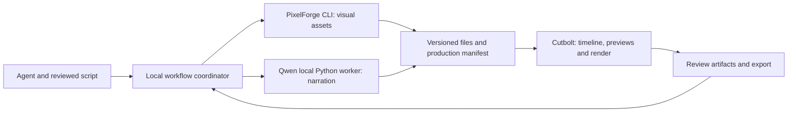

# PixelForge + Qwen + Cutbolt: agent handoff

Prepared 2 October 2026. **The bounded P1/P2 scene pilot is implemented, and since 5 October 2026 so is the local workflow coordinator: [`tools/production.py`](PRODUCTION.md) builds a narrated pixel-art explainer from one manifest.** Human review, reference-voice narration and the P4-P6 acceptance cases remain partly open; see [pilot results](pipeline/RESULTS.md). See [SCENES.md](SCENES.md) for executable scene commands. Read [USAGE.md](USAGE.md) for supported engine commands. Preparation and downloaded weights do not earn editing capability points.

## What the user agreed

Make Cutbolt compatible with PixelForge and Qwen3-TTS through local files and small adapters, while keeping the projects independent. Use a 60-90-second, six-scene narrated pixel-art explainer as the first YouTube production target. Include stages of review and demonstrate selective revisions and recovery. The user also requested local Qwen weights.

The proposed selling point is dependable iteration: an agent can explain and revise part of a video while preserving approved work, then continue after interruption. Compatibility and a successful first export alone do not establish a competitive advantage. Measure revision success, unintended changes and time to a useful preview.

YouTube is the delivery use case. Account connection, upload, publication, cloud services and analytics are not part of this work. The full existing editing/interchange roadmap remains in scope; this pilot prioritizes a concrete workflow without changing the 100-point denominator.

## Read next

1. [Production contract](pipeline/CONTRACT.md): asset identities, exact timing, review invalidation and recovery rules.
2. [Acceptance plan](pipeline/ACCEPTANCE.md): implementation slices, evidence and failure cases.
3. [Example production manifest](pipeline/example.production.json): the original six-scene brief as an executable `cutbolt-production-1` manifest for [`tools/production.py`](PRODUCTION.md).
4. [Current engine usage](USAGE.md), [broader plan](PLAN.md), [dependency ledger](DEPENDENCIES.md) and [progress history](PROGRESS_HISTORY.md).

## Responsibilities



| Component | Owns | Interface boundary |
| --- | --- | --- |
| PixelForge | Editable pixel art, frame exports, animation timing, visual inspection and bounded patches | Existing CLI first; optional existing stdio MCP. No source copied into Cutbolt |
| Qwen3-TTS | Speech synthesis from approved text and a permitted reference voice | Separate Python process loading local weights; writes a fresh WAV and receipt |
| Cutbolt | Media validation, exact timeline timing, composition, audio, previews and export | Existing Rust library/JSON CLI, extended through explicit capability work |
| Workflow coordinator | Scene dependencies, durable stage receipts, review decisions and resuming tasks | [`tools/production.py`](PRODUCTION.md): a local tool, not an engine command (reasons in [PRODUCTION.md](PRODUCTION.md#engine-command-or-local-coordinator-the-decision)). Local file/state contract under each production folder; no listening service; engine jobs and sessions reused through their public requests. No orchestration fields in PixelForge recipes or Cutbolt snapshots |

Use argument arrays rather than shell-built commands. Keep adapters replaceable: a user-supplied PNG sequence or WAV must enter through the same media contract. Review can happen through local images, audio and video artifacts; a dedicated review application is not required.

## Current baseline and gaps

Cutbolt v0.4 retains transactional sessions, durable edit receipts, undo/history and the v0.3 persisted Windows reference-render queue with MCP stdio. `session.preview` remains a semantic edit diff; `preview.frame` now exports video pixels and `preview.range` renders exact intervals.

The timeline renderer still requires sequential 25 fps FFV1/bgr0 with 48 kHz stereo PCM. A separate bounded scene compiler now accepts PNG sequences/layers and WAV narration, with explicit animation sampling, static crop/rotation/integer scale, straight alpha/opacity compositing and deterministic audio conversion. Its flattened output enters ordinary timeline sessions. See [SCENES.md](SCENES.md) for exact limits, including two-minute scenes of up to 64 layers and compilation without stage persistence or cancellation of a running job.

The live PixelForge PNG/timing file handoff has been exercised against the recorded commit. Qwen inference, voice quality, GPU memory, production caption integration, general linked tracks, production review/rebuild/recovery and production delivery integration remain open. A standalone [H.264/AAC export profile](EXPORT.md) now has independent technical evidence; this does not close the six-scene production or human-review criteria. The [results](pipeline/RESULTS.md) distinguish those gaps from the passing technical fixture.

## Review stages

| Gate | Review artifact | Decision |
| --- | --- | --- |
| Script and scene plan | Script with stable scene IDs, sources for factual claims, planned durations | Story, factual accuracy and audience fit |
| Storyboard | Native-size and intended-size contact sheets, scene order | Readability, visual consistency and coverage |
| Narration | Per-scene WAV with exact text and measured duration | Pronunciation, completeness, delivery and voice consistency |
| Rough cut | Low-cost video preview, caption timing and semantic change report | Pacing, synchronization and effects of revisions |
| Final export | Final playback artifact plus technical report | Human editorial approval of this exact export |

Mechanical checks and editorial judgment are separate records. The default pilot uses a human for editorial gates; agents can prepare critique and run technical checks. A project may explicitly delegate selected gates to an agent and must record that policy. Neither a hash nor a successful render constitutes human approval. Unrelated preparation can continue while a decision is pending.

Approvals bind to artifact/dependency identities and a review policy version. A text change invalidates that scene's speech and captions; an artwork change does not invalidate speech. A shared palette change affects every dependent visual. If timing changes shift later scenes, those placements and the rough/final cut need review even when the later scene assets remain approved. Details are in the [contract](pipeline/CONTRACT.md).

## First production brief

Working topic: **How a few still pictures become an animation**. Original narration and a six-scene plan are in the example manifest. Target 72 seconds, with six provisional 12-second slots; the real target is 60-90 seconds after voice measurement and review. Do not stretch or truncate speech to force the provisional duration.

Use a 320 x 180 logical composition enlarged six times with nearest-neighbor sampling for a 1920 x 1080 SDR, 25 fps final image. Small PixelForge sprites fit within its documented recipe limits; the 320 x 180 composition is Cutbolt's proposed canvas, not an assumption that PixelForge sprite recipes accept that size. Use independent narration and optional original synthetic sound effects; music is unnecessary for the first pilot. Export captions alongside the video, with optional burned-in captions only once text rendering is supported and tested.

The demonstration must include: produce a first cut, recolor one visual, replace scene four's narration, explicitly handle a longer take, and interrupt/restart one operation. Report what was reused and what was rebuilt. Do not claim limited rerendering until it is implemented and measured.

## Local preparation record

Observed on this machine on 2 October 2026; repeat preflight before implementation. These are inventory facts, not a supported-platform matrix.

| Item | Observation |
| --- | --- |
| Checkout | `C:\DEV\AgentCut`; preferred alias `C:\DEV\Cutbolt` is a junction to the same files |
| PixelForge | `C:\DEV\PixelForge`, package `pixelforge-agent` 0.1.0, MIT, commit `911d4fa167bdea5949669c20679693257e3cc170`; only `.claude/` appeared untracked at inspection |
| Node | v24.19.0; PixelForge requires Node 20+ |
| Python on PATH | 3.11.5; existing environment contains torch 2.4.0, transformers 4.44.2, safetensors 0.4.4 and huggingface-hub 0.23.4 |
| Qwen inference package | `qwen-tts` and `soundfile` were absent from this Python environment; other environments were not inventoried |
| GPU | NVIDIA GeForce RTX 4090, reported 24,564 MiB, driver 591.86; not an inference benchmark |
| FFmpeg/ffprobe | Existing external tools and verified build are recorded in [DEPENDENCIES.md](DEPENDENCIES.md) |

Later observation, 4 October 2026: PixelForge `pixelforge-agent` 0.7.0 at commit `d1dcb2a9d1aaadeb86663e997efc050a71881d44` worked unchanged with `tools/pixelforge_handoff.py` in an external demonstration. This is an observed compatibility, not a new acceptance result; record and test the exact commit again before relying on it.

Keep the Qwen inference environment separate from the system Python and the Rust engine. Resolve, pin and record its actual Python/PyTorch/CUDA/package combination during the inference slice. The inventory above is not a recommendation to reuse those installed versions. FlashAttention is optional upstream; do not make a difficult Windows extension build a prerequisite for initial correctness.

### Model setup

The requested snapshot is pinned to:

- Repository: `Qwen/Qwen3-TTS-12Hz-0.6B-Base`
- Revision: `5d83992436eae1d760afd27aff78a71d676296fc`
- External directory: `C:\DEV\CutboltData\models\Qwen3-TTS-12Hz-0.6B-Base\5d83992436eae1d760afd27aff78a71d676296fc`
- The snapshot includes `speech_tokenizer/`; a second tokenizer weight download is unnecessary.
- Total upstream snapshot size: 2,516,106,051 bytes (about 2.52 GB), excluding local transfer metadata and our receipt.
- The model card reports Apache-2.0. External tools/models retain their own licenses.

**Preparation result:** all 13 snapshot files were downloaded and verified against upstream digests on 2 October 2026. The completion receipt is in that external model directory. This confirms file integrity only; model loading/inference has not been tested.

The explicit setup command is:

```powershell
python tools/download_qwen.py --output-root C:\DEV\CutboltData\models
```

This uses the separately installed `huggingface-hub` package (0.23.4 used for preparation), pins the revision, refuses mismatching existing snapshot files, and verifies upstream size and LFS SHA-256/Git blob digests. It writes `download-receipt.json` with SHA-256 for every file after completion. Interrupted transfers can be retried with the same command. Setup accesses Hugging Face; it is never invoked by the engine, production worker or normal verification suite. No weights are stored in this repository.

For a production worker, pass the absolute model directory to `Qwen3TTSModel.from_pretrained`, use a local reference WAV, and set `HF_HUB_OFFLINE=1` and `TRANSFORMERS_OFFLINE=1` in that worker's environment. Test with networking unavailable; missing files must fail with an actionable error instead of triggering setup. Flags and downloaded files alone are not evidence of an offline inference test.

The Base checkpoint uses reference-audio voice cloning. Obtain a short user-owned or otherwise permitted reference voice and its accurate transcript before the first real narration test. Do not silently download the upstream demo speaker. For preset speakers without a reference recording, use the CustomVoice checkpoint below. Generated audio must be inspected for its real sample rate and channel count; `12Hz` in the model name is not its WAV sample rate. Qwen output is not evidence of word-level caption timing; alignment is a separate task.

### Preset-speaker model (CustomVoice)

`tools/download_qwen.py --repository` selects one of the pinned snapshots; the default remains Base:

```powershell
python tools/download_qwen.py --output-root C:\DEV\CutboltData\models --repository Qwen/Qwen3-TTS-12Hz-0.6B-CustomVoice
```

- Repository: `Qwen/Qwen3-TTS-12Hz-0.6B-CustomVoice`, revision `85e237c12c027371202489a0ec509ded67b5e4b5`; the model card reports Apache-2.0.
- External directory: `C:\DEV\CutboltData\models\Qwen3-TTS-12Hz-0.6B-CustomVoice\85e237c12c027371202489a0ec509ded67b5e4b5`. All 13 snapshot files (2,498,388,392 bytes) verified against upstream digests on 4 October 2026, with the same receipt format as Base. Main model SHA-256 `bc3c7e785eb961179c25450d1acff03f839e0002f2f3a5aeb67b5735c0fa2adb`; the bundled speech tokenizer has the same digest as Base.
- Built-in speakers: aiden, dylan, eric, ono_anna, ryan, serena, sohee, uncle_fu and vivian.

An external demonstration ran this checkpoint under WSL with its own package directory (`qwen-tts` 0.1.1, `transformers` 4.57.3, `accelerate` 1.12.0, `torchaudio` 2.3.1+cu121 and `numpy` 1.26.4, reusing `torch` 2.3.1+cu121), with networking disabled. It loaded in 15 s, generated 54.8 s of speech in 89.8 s and peaked at 2.58 GB of GPU memory. Output is 24 kHz mono WAV, which scene and audio recipes convert to 48 kHz stereo. These are observations from one run, not acceptance evidence for Y06.

### External working directories

Use `C:\DEV\CutboltData\pipeline\<run-id>\` with distinct `sources`, `generated`, `normalized`, `previews`, `exports` and `state` directories. Keep model snapshots shared under `C:\DEV\CutboltData\models`. Every run and artifact version gets a fresh destination. Configure the input/output/store roots explicitly; resolve junctions and links before checking boundaries. Credentials, voice references, media, environments, caches and databases stay outside Git.

## Start here when implementation resumes

P1/P2 and the coordinator exist. Continue with the open P3-P6 cases in the [acceptance plan](pipeline/ACCEPTANCE.md): a permitted reference voice for the Base model, human review gates on a real production, and the measurements in [RESULTS.md](pipeline/RESULTS.md). Historical note: the plan was to implement slice P1 first and not to start with a six-scene orchestration framework; that order was followed. Qwen runtime setup can proceed independently after the weights are verified, but an editorial voice test needs the permitted voice reference. No concrete narrator has been selected.

Keep [PROGRESS_HISTORY.md](PROGRESS_HISTORY.md) current. Run `python tools/verify.py --date 2026-10-02` for this preparation and the appropriate local date for later work. Add editing evidence only when it covers an existing criterion; record workflow compatibility results separately. See the acceptance plan for which existing capability IDs may eventually be affected.

## Preparation verification and shared-workspace status

The draft JSON was parsed and checked for six distinct scenes, 72 seconds of planned duration and no fabricated assets or reviews. Local documentation links resolved. The download helper rejected relative, repository-local and junction-alias destinations; a repeated setup preserved all snapshot files and the original receipt. A separate offline SHA-256 pass verified all 13 files against the receipt. The repository material check passed.

The full `tools/verify.py` command was attempted twice, with a second attempt after source changes were observed. Both stopped at `cargo fmt --check` in concurrent Rust command/render/job work, before engine tests ran. Those source files were not edited by this preparation. The existing generated progress report and engine evidence were not regenerated or represented as current verification. The previously verified baseline was 10/100 editing points and 8/10 agent checks; the new download helper and concurrent source edits require a successful full verification to refresh fingerprints. Resume from the latest `USAGE.md` and actual capabilities after that work is complete, rather than assuming this document's v0.2 inventory describes a later engine version.

## Upstream references

- [PixelForge](https://github.com/skulitom/PixelForge) and its [agent guide](https://github.com/skulitom/PixelForge/blob/main/docs/agent-guide.md): external toolkit interface; inspect its local skill before authoring art.
- [Pinned Qwen Base model card](https://huggingface.co/Qwen/Qwen3-TTS-12Hz-0.6B-Base/blob/5d83992436eae1d760afd27aff78a71d676296fc/README.md): Base usage and reported model license.
- [Qwen official usage](https://github.com/QwenLM/Qwen3-TTS): local-directory loading, variant distinctions and optional acceleration.

Subsequent implementation note: v0.3/v0.4 full verification supersedes the preparation-time formatting limitation above. The live bounded PixelForge handoff and scene/previews are now tested; use [SCENES.md](SCENES.md), [RESULTS.md](pipeline/RESULTS.md) and the generated progress report for the current state. Real Qwen inference and the full production workflow remain unverified.
